# Introduction to C++ and Object-Oriented Programming (OOP)

In this tutorial, we will introduce you to the basics of C++ programming with a focus on Object-Oriented Programming (OOP). We will cover:

1. Introduction to Arrays in C++
2. Structures in C++
3. Object-Oriented Programming in C++
4. Arrays of Structures
5. Linked Lists
6. Loading and Saving Elements in Arrays
7. Why Use Arrays of Structures

Throughout the tutorial, we will include detailed explanations, code examples, and diagrams using Typora-supported formats like Mermaid to help you understand these concepts better.

---

## Table of Contents

1. [Introduction to Arrays in C++](#introduction-to-arrays-in-c)
   - [Defining Arrays](#defining-arrays)
   - [Accessing Array Elements](#accessing-array-elements)
   - [Initializing Arrays](#initializing-arrays)
   - [Multidimensional Arrays](#multidimensional-arrays)
2. [Structures in C++](#structures-in-c)
   - [Defining a Structure](#defining-a-structure)
   - [Creating Structure Variables](#creating-structure-variables)
   - [Accessing Structure Members](#accessing-structure-members)
   - [Initializing Structures](#initializing-structures)
3. [Object-Oriented Programming in C++](#object-oriented-programming-in-c)
   - [Classes and Objects](#classes-and-objects)
   - [Encapsulation](#encapsulation)
   - [Inheritance](#inheritance)
   - [Polymorphism](#polymorphism)
   - [Abstraction](#abstraction)
   - [Example Code](#example-code)
4. [Arrays of Structures](#arrays-of-structures)
   - [Defining an Array of Structures](#defining-an-array-of-structures)
   - [Accessing Array Elements](#accessing-array-elements)
   - [Initializing Arrays of Structures](#initializing-arrays-of-structures)
   - [Using Loops with Arrays of Structures](#using-loops-with-arrays-of-structures)
5. [Linked Lists](#linked-lists)
   - [What is a Linked List](#what-is-a-linked-list)
   - [Why Linked Lists are Needed](#why-linked-lists-are-needed)
   - [Types of Linked Lists](#types-of-linked-lists)
     - [Singly Linked List](#singly-linked-list)
     - [Doubly Linked List](#doubly-linked-list)
     - [Circular Linked List](#circular-linked-list)
   - [Operations on Linked Lists](#operations-on-linked-lists)
   - [Advantages and Disadvantages of Linked Lists](#advantages-and-disadvantages-of-linked-lists)
   - [Linked List vs. Array](#linked-list-vs-array)
   - [Applications of Linked Lists](#applications-of-linked-lists)
6. [Loading and Saving Elements in Arrays](#loading-and-saving-elements-in-arrays)
7. [Why Use Arrays of Structures](#why-use-arrays-of-structures)
8. [Exercises](#exercises)
9. [Conclusion](#conclusion)

---

## Introduction to Arrays in C++

An array is a collection of items stored at contiguous memory locations. In C++, arrays allow you to store multiple items of the same data type together. Arrays are fundamental to programming and are used extensively for data manipulation.

### Defining Arrays

You can define an array by specifying the data type, the array name, and the number of elements it can hold.

**Syntax:**

```cpp
dataType arrayName[arraySize];
```

**Example:**

```cpp
int numbers[5]; // An array of 5 integers
```

### Accessing Array Elements

Array elements are accessed using indices, starting from 0 up to `arraySize - 1`.

**Example:**

```cpp
numbers[0] = 10; // Assign 10 to the first element
int x = numbers[0]; // Retrieve the first element
```

### Initializing Arrays

Arrays can be initialized at the time of declaration.

**Example:**

```cpp
int numbers[5] = {10, 20, 30, 40, 50};
```

If you omit the size, the compiler determines it based on the number of initializers.

```cpp
int numbers[] = {10, 20, 30, 40, 50}; // Size is 5
```

### Multidimensional Arrays

C++ supports multidimensional arrays, which are arrays of arrays.

**Example:**

```cpp
int matrix[3][4]; // A 2D array with 3 rows and 4 columns
```

**Accessing Elements:**

```cpp
matrix[0][0] = 1; // Assign 1 to the element in the first row and first column
```

**Initializing Multidimensional Arrays:**

```cpp
int matrix[2][2] = {{1, 2}, {3, 4}};
```

---

## Structures in C++

Structures (`struct`s) in C++ are user-defined data types that allow you to group variables of different types under a single name. They are essential for organizing complex data and are a precursor to classes in OOP.

### Defining a Structure

You define a structure using the `struct` keyword, followed by the structure's name and its members enclosed in braces `{}`.

**Syntax:**

```cpp
struct StructureName {
    dataType member1;
    dataType member2;
    // More members
};
```

**Example:**

```cpp
struct Person {
    std::string name;
    int age;
    float height;
};
```

**Structure Diagram:**

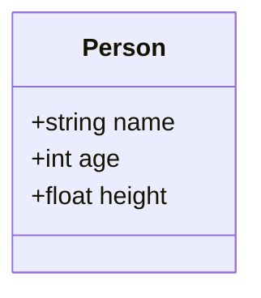

### Creating Structure Variables

Once a structure is defined, you can create variables of that structure type.

**Example:**

```cpp
Person person1; // Create a variable of type Person
```

### Accessing Structure Members

Use the dot `.` operator to access or modify the members of a structure variable.

**Example:**

```cpp
person1.name = "Alice";
person1.age = 30;
person1.height = 5.5;

std::cout << "Name: " << person1.name << std::endl;
std::cout << "Age: " << person1.age << std::endl;
std::cout << "Height: " << person1.height << std::endl;
```

### Initializing Structures

You can initialize structures at the time of declaration.

**Example:**

```cpp
Person person2 = {"Bob", 25, 6.0};
```

---

## Object-Oriented Programming in C++

Object-Oriented Programming (OOP) is a programming paradigm that uses "objects" to design applications and programs. It utilizes several concepts like classes, objects, inheritance, encapsulation, polymorphism, and abstraction.

### Classes and Objects

- **Class:** A blueprint for creating objects. It encapsulates data for the object and methods to manipulate that data.
- **Object:** An instance of a class.

**Defining a Class:**

```cpp
class Person {
private:
    std::string name;
    int age;
    float height;

public:
    // Constructor
    Person(std::string n, int a, float h) : name(n), age(a), height(h) {}

    // Getter and Setter for name
    void setName(std::string n) { name = n; }
    std::string getName() { return name; }

    // Other member functions
    void displayInfo();
};
```

**Creating Objects:**

```cpp
Person person1("Alice", 30, 5.5); // Create an object of type Person
```

### Encapsulation

Encapsulation is the bundling of data and methods that operate on that data within one unit, e.g., a class in C++. It restricts direct access to some of an object's components.

**Example:**

- The class `Person` has private data members.
- Access to these members is controlled through public methods.

### Inheritance

Inheritance allows a class to inherit attributes and methods from another class.

**Example:**

```cpp
class Employee : public Person {
private:
    int employeeID;
    double salary;

public:
    Employee(std::string n, int a, float h, int id, double s)
        : Person(n, a, h), employeeID(id), salary(s) {}

    void setEmployeeID(int id) { employeeID = id; }
    int getEmployeeID() { return employeeID; }

    void displayInfo();
};
```

**Inheritance Diagram:**

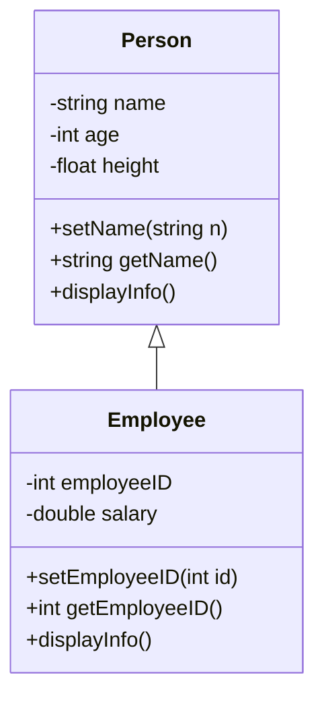

### Polymorphism

Polymorphism allows methods to do different things based on the object it is acting upon.

- **Compile-time Polymorphism:** Achieved using function overloading and operator overloading.
- **Runtime Polymorphism:** Achieved using inheritance and virtual functions.

**Example:**

```cpp
class Person {
public:
    virtual void displayInfo() {
        std::cout << "This is a person." << std::endl;
    }
};

class Employee : public Person {
public:
    void displayInfo() override {
        std::cout << "This is an employee." << std::endl;
    }
};

Person* p = new Employee();
p->displayInfo(); // Outputs: This is an employee.
```

### Abstraction

Abstraction means hiding complex implementation details and showing only the necessary features of an object.

- Achieved using abstract classes (classes containing at least one pure virtual function).

**Example:**

```cpp
class Shape {
public:
    virtual double area() = 0; // Pure virtual function
};

class Circle : public Shape {
private:
    double radius;
public:
    Circle(double r) : radius(r) {}
    double area() override {
        return 3.1415 * radius * radius;
    }
};
```

### Example Code

**Person Class Implementation:**

```cpp
#include <iostream>
#include <string>

class Person {
private:
    std::string name;
    int age;
    float height;

public:
    // Constructor
    Person(std::string n, int a, float h) : name(n), age(a), height(h) {}

    // Getter and Setter for name
    void setName(std::string n) { name = n; }
    std::string getName() { return name; }

    // Getter and Setter for age
    void setAge(int a) { age = a; }
    int getAge() { return age; }

    // Getter and Setter for height
    void setHeight(float h) { height = h; }
    float getHeight() { return height; }

    // Display Information
    virtual void displayInfo() {
        std::cout << "Name: " << name << ", Age: " << age
                  << ", Height: " << height << std::endl;
    }
};

class Employee : public Person {
private:
    int employeeID;
    double salary;

public:
    // Constructor
    Employee(std::string n, int a, float h, int id, double s)
        : Person(n, a, h), employeeID(id), salary(s) {}

    // Getter and Setter for employeeID
    void setEmployeeID(int id) { employeeID = id; }
    int getEmployeeID() { return employeeID; }

    // Getter and Setter for salary
    void setSalary(double s) { salary = s; }
    double getSalary() { return salary; }

    // Overriding displayInfo
    void displayInfo() override {
        Person::displayInfo();
        std::cout << "Employee ID: " << employeeID
                  << ", Salary: " << salary << std::endl;
    }
};

int main() {
    Employee emp("Bob", 28, 5.9, 1001, 75000);
    emp.displayInfo();
    return 0;
}
```

**Output:**

```
Name: Bob, Age: 28, Height: 5.9
Employee ID: 1001, Salary: 75000
```

---

## Arrays of Structures

An array of structures is a collection of structure variables, allowing you to manage multiple records of the same type efficiently.

### Defining an Array of Structures

Define an array with the structure type as its element type.

**Syntax:**

```cpp
StructureName arrayName[arraySize];
```

**Example:**

```cpp
Person people[3]; // Array of 3 Person structures
```

### Accessing Array Elements

Access elements using the array index and the dot `.` operator.

**Example:**

```cpp
people[0].name = "Alice";
people[0].age = 30;
people[0].height = 5.5;

people[1].name = "Bob";
people[1].age = 25;
people[1].height = 6.0;
```

### Initializing Arrays of Structures

You can initialize an array of structures at the time of declaration.

**Example:**

```cpp
Person people[2] = {
    {"Alice", 30, 5.5},
    {"Bob", 25, 6.0}
};
```

### Using Loops with Arrays of Structures

Loops are often used to iterate through an array of structures for tasks such as printing, searching, or modifying data.

**Example:**

```cpp
Person people[3] = {
    {"Alice", 30, 5.5},
    {"Bob", 25, 6.0},
    {"Charlie", 28, 5.8}
};

// Print all people
for (int i = 0; i < 3; ++i) {
    std::cout << "Person " << i + 1 << ": " << people[i].name
              << ", " << people[i].age << ", " << people[i].height << std::endl;
}
```

---

## Linked Lists

### What is a Linked List

A linked list is a fundamental data structure in computer science. It consists of nodes where each node contains data and a reference (link) to the next node in the sequence. This allows for dynamic memory allocation and efficient insertion and deletion operations compared to arrays.

### Why Linked Lists are Needed

Linked lists are essential when you need:

- **Dynamic Data Structure:** They can grow or shrink at runtime.
- **Efficient Insertions/Deletions:** Especially in the middle of the list.
- **Efficient Memory Utilization:** Memory is allocated as needed.
- **Implementation Flexibility:** Useful for implementing other data structures like stacks, queues, graphs, etc.

### Types of Linked Lists

#### Singly Linked List

In a singly linked list, each node contains a reference to the next node in the sequence. Traversal is only in one direction.

**Node Structure:**

```cpp
struct Node {
    int data;
    Node* next;
};
```

**Diagram:**

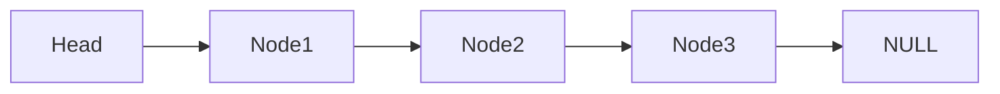

#### Doubly Linked List

In a doubly linked list, each node contains references to both the next and previous nodes, allowing traversal in both directions.

**Node Structure:**

```cpp
struct Node {
    int data;
    Node* prev;
    Node* next;
};
```

**Diagram:**

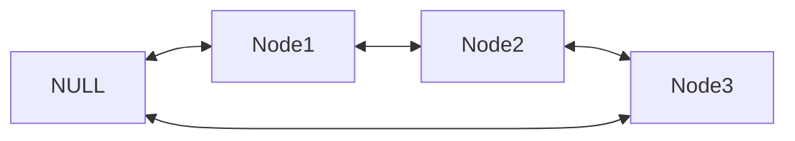

#### Circular Linked List

In a circular linked list, the last node points back to the head node, forming a circle. It can be singly or doubly linked.

**Diagram:**

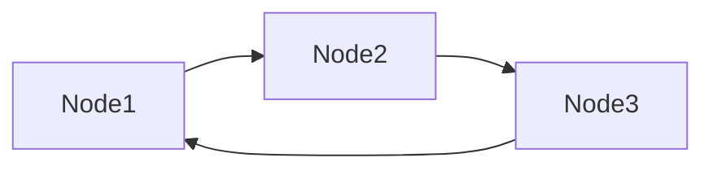

### Operations on Linked Lists

#### Insertion

Adding a new node to a linked list involves adjusting the pointers of the existing nodes to maintain the proper sequence.

- **At the Beginning**
- **At the End**
- **At a Specific Position**

#### Deletion

Removing a node from a linked list requires adjusting the pointers of the neighboring nodes to bridge the gap left by the deleted node.

- **From the Beginning**
- **From the End**
- **From a Specific Position**

#### Searching

Searching for a specific value in a linked list involves traversing the list from the head node until the value is found or the end of the list is reached.

### Advantages and Disadvantages of Linked Lists

#### Advantages

- **Dynamic Size:** Can grow or shrink during runtime.
- **Efficient Insertions/Deletions:** Especially in the middle of the list.
- **Memory Utilization:** No need to allocate a large contiguous block of memory.
- **Implementation Flexibility:** Can be used to implement stacks, queues, and other data structures.

#### Disadvantages

- **No Random Access:** Cannot access elements directly by index; must traverse from the head.
- **Extra Memory:** Requires additional memory for pointers.
- **Sequential Access:** Traversal from the head node is required.
- **Complexity:** Pointers must be handled carefully to avoid errors.

### Linked List vs. Array

| Operation                | Linked List | Array    |
|--------------------------|-------------|----------|
| Random Access            | O(N)        | O(1)     |
| Insertion at Beginning   | O(1)        | O(N)     |
| Insertion at End         | O(1)*       | O(1)     |
| Insertion at Middle      | O(N)        | O(N)     |
| Deletion at Beginning    | O(1)        | O(N)     |
| Deletion at End          | O(1)*       | O(1)     |
| Deletion at Middle       | O(N)        | O(N)     |

*Assuming tail pointer is maintained.

### Applications of Linked Lists

- **Dynamic Memory Allocation**
- **Implementing Stacks and Queues**
- **Graph Representation (Adjacency Lists)**
- **Undo Mechanisms in Software**
- **Browser History Navigation**
- **Music Playlists**

---

## Loading and Saving Elements in Arrays

### Loading Elements into an Array

Loading elements into an array involves reading data from a source and storing it into the array.

**Example:**

```cpp
const int SIZE = 5;
int numbers[SIZE];

// Load elements from user input
for (int i = 0; i < SIZE; ++i) {
    std::cout << "Enter number " << i + 1 << ": ";
    std::cin >> numbers[i];
}
```

### Saving Elements from an Array

Saving elements from an array could involve displaying them or writing them to a file.

**Example:**

```cpp
// Display elements
for (int i = 0; i < SIZE; ++i) {
    std::cout << "Number " << i + 1 << ": " << numbers[i] << std::endl;
}

// Save elements to a file
#include <fstream>
std::ofstream outFile("numbers.txt");
if (outFile.is_open()) {
    for (int i = 0; i < SIZE; ++i) {
        outFile << numbers[i] << std::endl;
    }
    outFile.close();
} else {
    std::cerr << "Unable to open file for writing." << std::endl;
}
```

---

## Why Use Arrays of Structures

We use arrays of structures to manage collections of related data that share the same structure. This approach offers several benefits:

- **Organized Data:** Grouping related data together makes the code more organized and easier to understand.
- **Efficient Data Management:** Arrays allow for easy iteration and bulk operations on data.
- **Scalability:** Easily handle a large number of records without writing repetitive code.
- **Maintainability:** Changes to the structure definition automatically apply to all instances.

**Example Use Case:**

Suppose you're managing a list of students, each with a name, ID, and grade. Using an array of structures simplifies data management.

**Structure Definition:**

```cpp
struct Student {
    std::string name;
    int id;
    char grade;
};
```

**Array of Structures:**

```cpp
const int NUM_STUDENTS = 3;
Student students[NUM_STUDENTS];
```

**Loading Data:**

```cpp
for (int i = 0; i < NUM_STUDENTS; ++i) {
    std::cout << "Enter details for student " << i + 1 << std::endl;
    std::cout << "Name: ";
    std::cin >> students[i].name;
    std::cout << "ID: ";
    std::cin >> students[i].id;
    std::cout << "Grade: ";
    std::cin >> students[i].grade;
}
```

**Saving Data:**

```cpp
// Display student details
for (int i = 0; i < NUM_STUDENTS; ++i) {
    std::cout << "Student " << i + 1 << ": " << students[i].name
              << ", ID: " << students[i].id << ", Grade: " << students[i].grade << std::endl;
}
```

**Explanation:**

- **Consistency:** All student records are stored in a consistent format.
- **Ease of Access:** Can access any student's information using array indexing.
- **Data Integrity:** Using structures reduces the risk of mismatched or incomplete data.

---

## Exercises

1. **Define a Structure for a Student:**

   Define a structure for storing a student’s information (name, age, and grade) and use it to store and display a student’s data.

2. **Array of Student Structures:**

   Define an array of structures to store information of multiple students and display the details of each student.

3. **Find the Oldest Student:**

   Create a structure for storing student information and write a program to find the oldest student from a list.

4. **Employee with Highest Salary:**

   Define a structure to store employee information, including ID, name, and salary. Write a program to find the employee with the highest salary.

5. **Calculate Average Grade:**

   Define a structure for a student with fields for name and grade. Create an array of this structure, then calculate and display the average grade of all students.

---

## Conclusion

In this tutorial, we've introduced the basics of C++ programming with an emphasis on arrays, structures, and Object-Oriented Programming (OOP). We explored how to define and use arrays and structures, delved into OOP concepts like classes, inheritance, polymorphism, and encapsulation, and demonstrated how these concepts interrelate. We also covered linked lists, loading and saving elements in arrays, and discussed the benefits of using arrays of structures. Understanding these fundamental concepts is crucial for organizing and managing complex data efficiently.

---

**Note:** The diagrams included in this guide are written in Mermaid syntax, which is supported by Typora. When you view this document in Typora, the diagrams will be rendered automatically.

If you have any questions or need further clarification on any topic, feel free to ask!


# Exercise Solutions with Diagrams

In this section, we will provide solutions to the exercises listed at the end of the guide. Each exercise will include the problem statement, solution approach, code implementation, explanations, and diagrams to help visualize the flow and structure of the program.

---

## 1. Define a Structure for a Student

**Problem Statement:**

Define a structure for storing a student’s information (name, age, and grade) and use it to store and display a student’s data.

### Solution:

We will create a `Student` structure with the members `name`, `age`, and `grade`. Then, we'll create an instance of this structure, prompt the user to input the data, and display the entered information.

### Code:

```cpp
#include <iostream>
#include <string>

struct Student {
    std::string name;
    int age;
    char grade;
};

int main() {
    Student student;

    // Input student data
    std::cout << "Enter student's name: ";
    std::getline(std::cin, student.name);

    std::cout << "Enter student's age: ";
    std::cin >> student.age;

    std::cout << "Enter student's grade (A-F): ";
    std::cin >> student.grade;

    // Display student data
    std::cout << "\nStudent Information:\n";
    std::cout << "Name: " << student.name << "\n";
    std::cout << "Age: " << student.age << "\n";
    std::cout << "Grade: " << student.grade << "\n";

    return 0;
}
```

### Explanation:

- **Structure Definition:** We define a `Student` structure to hold the student's name, age, and grade.
- **Data Input:** We use `std::getline` to read the student's name to allow for spaces in the input. For age and grade, we use `std::cin`.
- **Data Display:** The student's information is displayed using `std::cout`.

### Diagram:

#### Structure Diagram

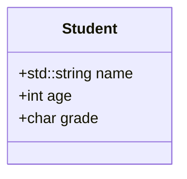

#### Flowchart of the Program

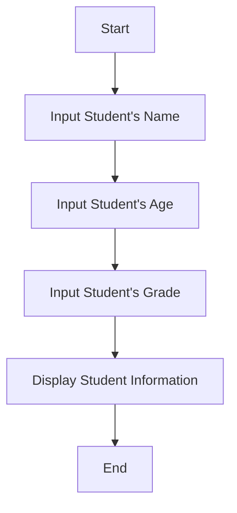

---

## 2. Array of Student Structures

**Problem Statement:**

Define an array of structures to store information of multiple students and display the details of each student.

### Solution:

We'll define an array of `Student` structures to hold multiple students' data. We'll use a loop to input and display each student's details.

### Code:

```cpp
#include <iostream>
#include <string>

struct Student {
    std::string name;
    int age;
    char grade;
};

int main() {
    const int NUM_STUDENTS = 3;
    Student students[NUM_STUDENTS];

    // Input data for each student
    for (int i = 0; i < NUM_STUDENTS; ++i) {
        std::cin.ignore(); // Clear input buffer
        std::cout << "\nEnter details for student " << i + 1 << ":\n";

        std::cout << "Name: ";
        std::getline(std::cin, students[i].name);

        std::cout << "Age: ";
        std::cin >> students[i].age;

        std::cout << "Grade (A-F): ";
        std::cin >> students[i].grade;
    }

    // Display student details
    std::cout << "\nStudent Details:\n";
    for (int i = 0; i < NUM_STUDENTS; ++i) {
        std::cout << "\nStudent " << i + 1 << ":\n";
        std::cout << "Name: " << students[i].name << "\n";
        std::cout << "Age: " << students[i].age << "\n";
        std::cout << "Grade: " << students[i].grade << "\n";
    }

    return 0;
}
```

### Explanation:

- **Array Definition:** We create an array `students` to hold data for multiple students.
- **Data Input Loop:** We use a `for` loop to input data for each student. `std::cin.ignore()` is used to clear the input buffer before `std::getline`.
- **Data Display Loop:** Another `for` loop is used to display each student's details.

### Diagrams:

#### Structure Diagram


#### Flowchart of the Program

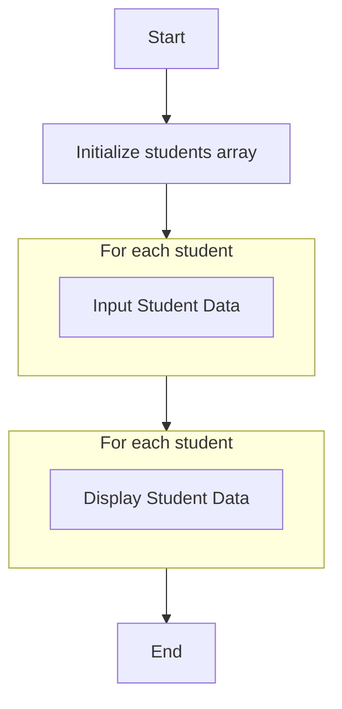

---

## 3. Find the Oldest Student

**Problem Statement:**

Create a structure for storing student information and write a program to find the oldest student from a list.

### Solution:

We will input data for multiple students into an array and then iterate through the array to find the student with the maximum age.

### Code:

```cpp
#include <iostream>
#include <string>

struct Student {
    std::string name;
    int age;
};

int main() {
    const int NUM_STUDENTS = 3;
    Student students[NUM_STUDENTS];

    // Input data for each student
    for (int i = 0; i < NUM_STUDENTS; ++i) {
        std::cin.ignore(); // Clear input buffer
        std::cout << "\nEnter details for student " << i + 1 << ":\n";

        std::cout << "Name: ";
        std::getline(std::cin, students[i].name);

        std::cout << "Age: ";
        std::cin >> students[i].age;
    }

    // Find the oldest student
    int oldestIndex = 0;
    for (int i = 1; i < NUM_STUDENTS; ++i) {
        if (students[i].age > students[oldestIndex].age) {
            oldestIndex = i;
        }
    }

    // Display the oldest student's information
    std::cout << "\nThe oldest student is:\n";
    std::cout << "Name: " << students[oldestIndex].name << "\n";
    std::cout << "Age: " << students[oldestIndex].age << "\n";

    return 0;
}
```

### Explanation:

- **Structure Simplification:** We only need `name` and `age` for this exercise.
- **Finding Oldest Student:** We initialize `oldestIndex` to 0 and update it whenever we find a student with a greater age.
- **Result Display:** We display the details of the oldest student using the index stored in `oldestIndex`.

### Diagrams:

#### Structure Diagram

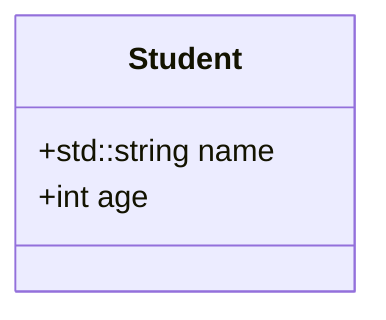

#### Flowchart of the Program

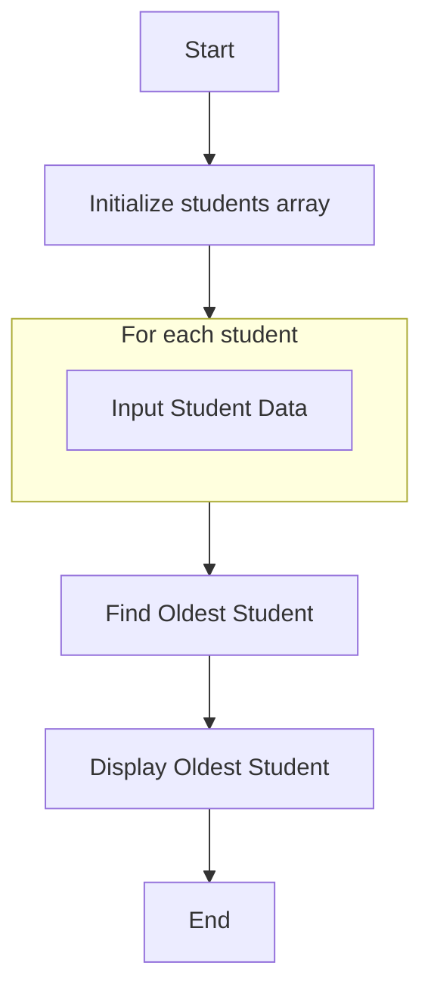

#### Detailed Flowchart for Finding the Oldest Student

```mermaid
flowchart TD
    StartFind --> SetOldestIndex[Set oldestIndex = 0]
    SetOldestIndex --> ForLoop[For i from 1 to NUM_STUDENTS - 1]
    ForLoop --> CheckAge{Is students[i].age > students[oldestIndex].age?}
    CheckAge -- Yes --> UpdateOldest[Set oldestIndex = i]
    CheckAge -- No --> NextIteration
    UpdateOldest --> NextIteration
    NextIteration --> ForLoop
    ForLoop --> EndFind
```

---

## 4. Employee with Highest Salary

**Problem Statement:**

Define a structure to store employee information, including ID, name, and salary. Write a program to find the employee with the highest salary.

### Solution:

We'll create an array of `Employee` structures, input their details, and determine which employee has the highest salary.

### Code:

```cpp
#include <iostream>
#include <string>

struct Employee {
    int id;
    std::string name;
    double salary;
};

int main() {
    const int NUM_EMPLOYEES = 3;
    Employee employees[NUM_EMPLOYEES];

    // Input data for each employee
    for (int i = 0; i < NUM_EMPLOYEES; ++i) {
        std::cin.ignore(); // Clear input buffer
        std::cout << "\nEnter details for employee " << i + 1 << ":\n";

        std::cout << "ID: ";
        std::cin >> employees[i].id;

        std::cin.ignore(); // Clear buffer before reading name
        std::cout << "Name: ";
        std::getline(std::cin, employees[i].name);

        std::cout << "Salary: ";
        std::cin >> employees[i].salary;
    }

    // Find the employee with the highest salary
    int highestIndex = 0;
    for (int i = 1; i < NUM_EMPLOYEES; ++i) {
        if (employees[i].salary > employees[highestIndex].salary) {
            highestIndex = i;
        }
    }

    // Display the employee with the highest salary
    std::cout << "\nEmployee with the highest salary:\n";
    std::cout << "ID: " << employees[highestIndex].id << "\n";
    std::cout << "Name: " << employees[highestIndex].name << "\n";
    std::cout << "Salary: $" << employees[highestIndex].salary << "\n";

    return 0;
}
```

### Explanation:

- **Data Types:** We use `double` for the salary to accommodate decimal values.
- **Finding Highest Salary:** Similar to previous exercises, we track the index of the employee with the highest salary.
- **Salary Formatting:** The salary is displayed with a dollar sign for clarity.

### Diagrams:

#### Structure Diagram

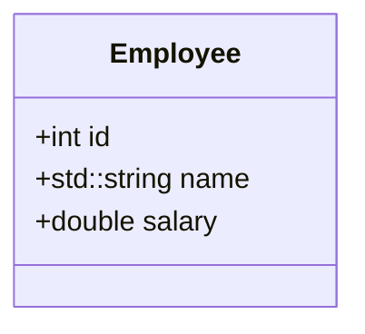

#### Flowchart of the Program

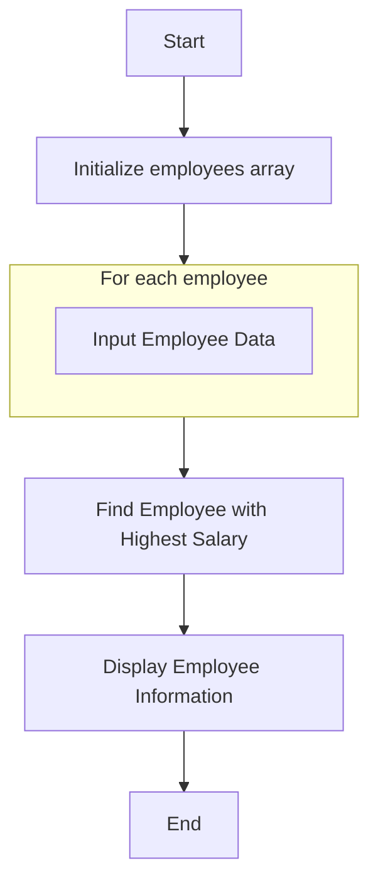

#### Detailed Flowchart for Finding the Highest Salary

```mermaid
flowchart TD
    StartFind --> SetHighestIndex[Set highestIndex = 0]
    SetHighestIndex --> ForLoop[For i from 1 to NUM_EMPLOYEES - 1]
    ForLoop --> CheckSalary{Is employees[i].salary > employees[highestIndex].salary?}
    CheckSalary -- Yes --> UpdateHighest[Set highestIndex = i]
    CheckSalary -- No --> NextIteration
    UpdateHighest --> NextIteration
    NextIteration --> ForLoop
    ForLoop --> EndFind
```

---

## 5. Calculate Average Grade

**Problem Statement:**

Define a structure for a student with fields for name and grade. Create an array of this structure, then calculate and display the average grade of all students.

### Solution:

We'll collect the grades for multiple students, sum them up, and then calculate the average.

### Code:

```cpp
#include <iostream>
#include <string>
#include <iomanip> // For output formatting

struct Student {
    std::string name;
    double grade;
};

int main() {
    const int NUM_STUDENTS = 3;
    Student students[NUM_STUDENTS];
    double totalGrades = 0.0;

    // Input data for each student
    for (int i = 0; i < NUM_STUDENTS; ++i) {
        std::cin.ignore(); // Clear input buffer
        std::cout << "\nEnter details for student " << i + 1 << ":\n";

        std::cout << "Name: ";
        std::getline(std::cin, students[i].name);

        std::cout << "Grade (0-100): ";
        std::cin >> students[i].grade;

        totalGrades += students[i].grade;
    }

    // Calculate average grade
    double averageGrade = totalGrades / NUM_STUDENTS;

    // Display average grade
    std::cout << std::fixed << std::setprecision(2);
    std::cout << "\nThe average grade of all students is: " << averageGrade << "\n";

    return 0;
}
```

### Explanation:

- **Grade Data Type:** We use `double` for grades to handle decimal values.
- **Total Grades Calculation:** We sum up all the grades as we input them.
- **Average Calculation:** The average is computed by dividing the total by the number of students.
- **Output Formatting:** We use `std::fixed` and `std::setprecision(2)` to display the average grade with two decimal places.

### Diagrams:

#### Structure Diagram

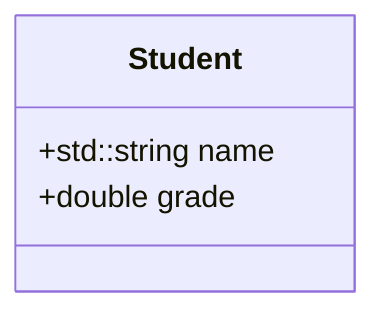

#### Flowchart of the Program

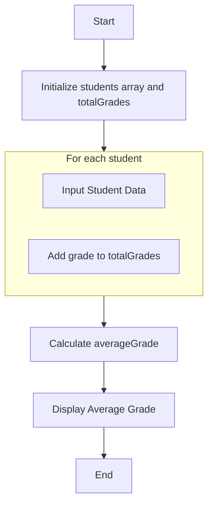

---

# Additional Notes

- **Input Buffer Handling:** When mixing `std::cin` and `std::getline`, it's important to handle the input buffer correctly. `std::cin` leaves a newline character in the buffer, which `std::getline` might read as an empty string. Using `std::cin.ignore()` helps to clear the buffer.

- **Data Validation:** For production code, it's advisable to include data validation to ensure that inputs like age, grade, and salary are within expected ranges.

- **Modularity:** In larger programs, consider breaking your code into functions to handle tasks like input, processing, and output.

- **Error Handling:** Implement error handling to manage unexpected inputs or runtime errors gracefully.

# Conclusion

By solving these exercises and including diagrams, we've reinforced our understanding of structures, arrays, and basic data manipulation in C++. The diagrams help visualize the flow of the programs and the relationships between data structures, making it easier to comprehend the logic and structure of the code. These foundational concepts are crucial for managing complex data efficiently and are stepping stones toward mastering Object-Oriented Programming and advanced data structures.

If you have any questions or need further clarification on any of the solutions, feel free to ask!
