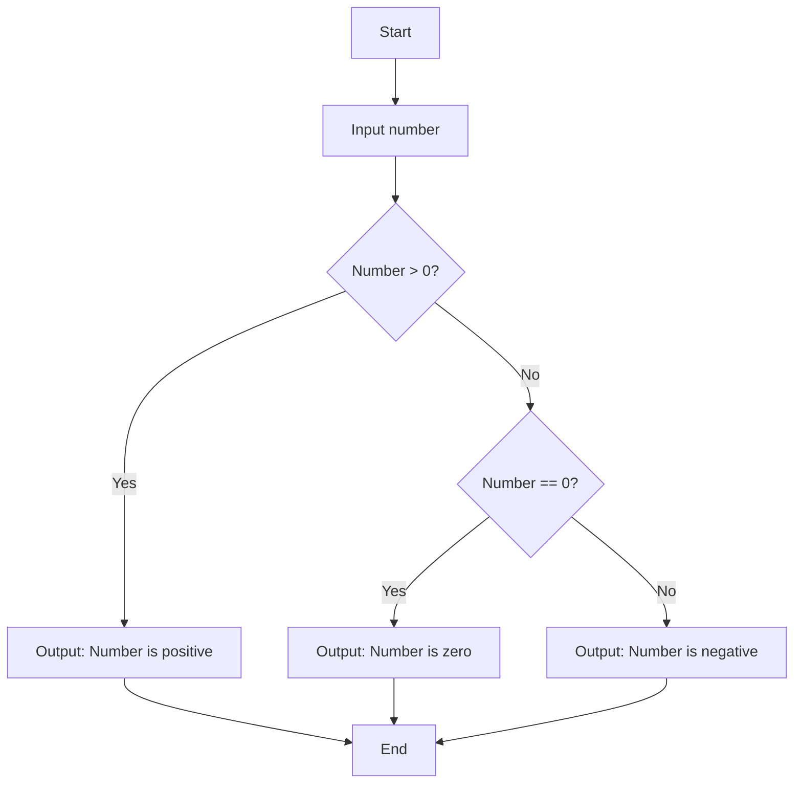
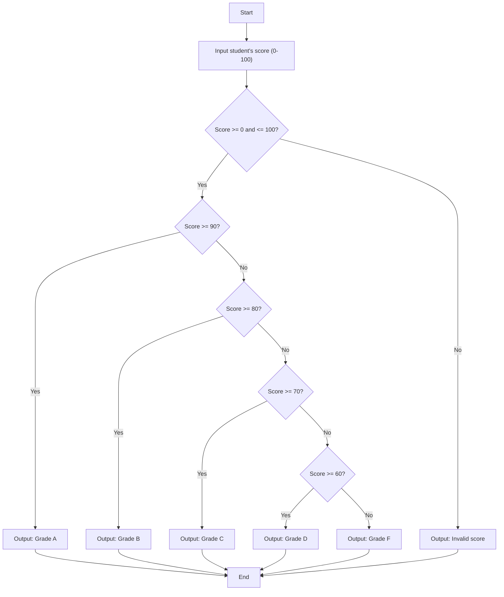
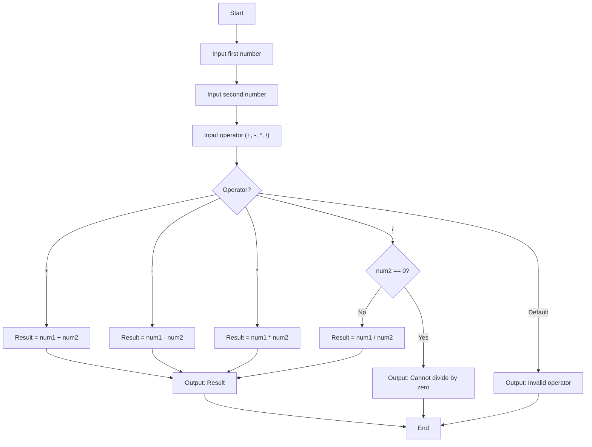
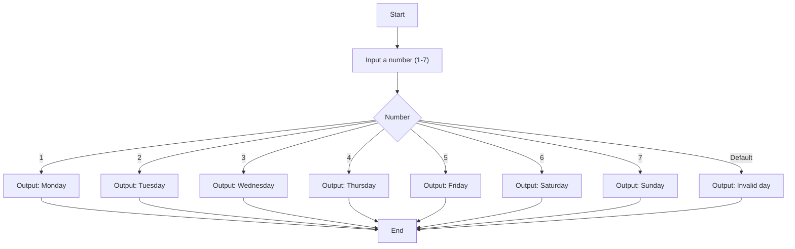
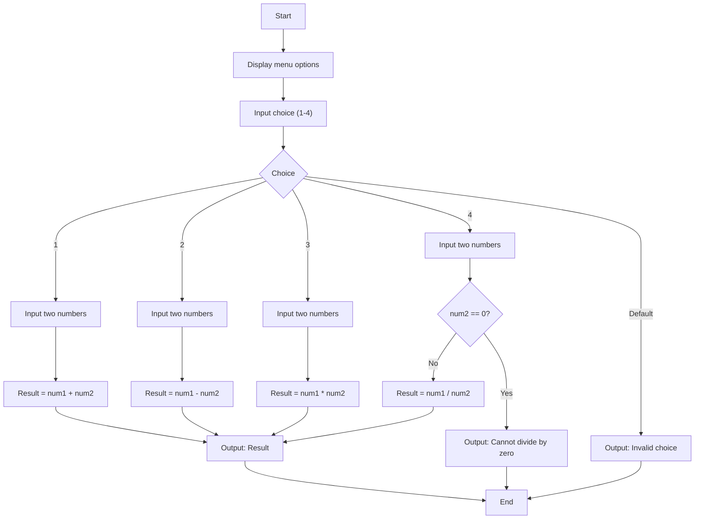
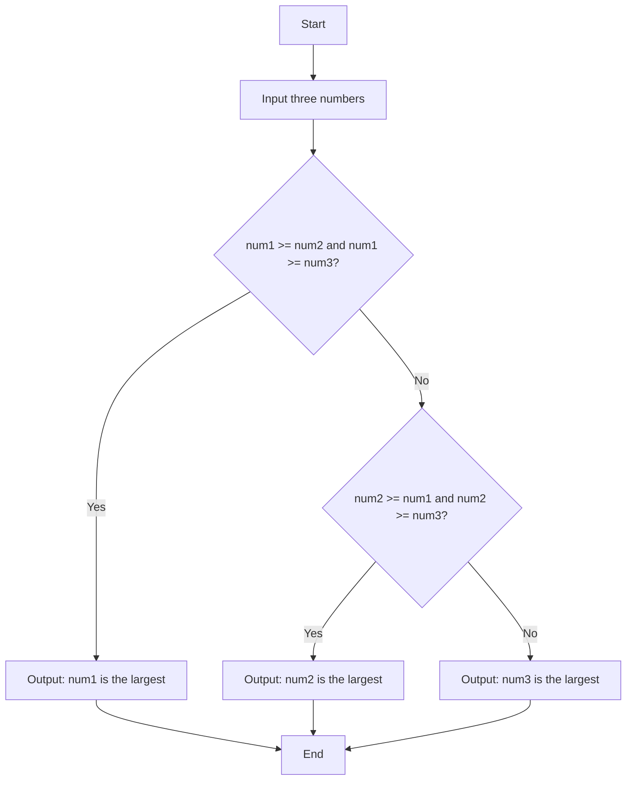

# Solutions to Sheet 3 Exercises

Below are the solutions to the exercises provided, including the C++ code, flowcharts in GitHub Markdown mermaid format, and the Input-Process-Output algorithms.

---

## Q1

**Problem:**  
Write a C++ program that takes an integer input from the user and determines if the number is positive, negative, or zero.

### Input-Process-Output Algorithm

- **Input:**
  - An integer number from the user.

- **Process:**
  - If the number is greater than zero, it is positive.
  - If the number is less than zero, it is negative.
  - If the number is zero, it is zero.

- **Output:**
  - A message indicating whether the number is positive, negative, or zero.

### Flowchart



### C++ Code

```cpp
#include <iostream>

int main() {
    int number;
    std::cout << "Enter an integer number: ";
    std::cin >> number;

    if (number > 0) {
        std::cout << "The number is positive.\n";
    } else if (number == 0) {
        std::cout << "The number is zero.\n";
    } else {
        std::cout << "The number is negative.\n";
    }

    return 0;
}
```

---

## Q2

**Problem:**  
Write a program that reads a student’s score (0–100) and assigns a grade based on the following scale:

- 90–100: Grade A
- 80–89: Grade B
- 70–79: Grade C
- 60–69: Grade D
- Below 60: Grade F

### Input-Process-Output Algorithm

- **Input:**
  - Student's score (an integer between 0 and 100).

- **Process:**
  - Check if the score is within the valid range (0–100).
  - Assign grades based on the score range.

- **Output:**
  - The grade assigned to the student.

### Flowchart



### C++ Code

```cpp
#include <iostream>

int main() {
    int score;
    std::cout << "Enter student's score (0-100): ";
    std::cin >> score;

    if (score >= 0 && score <= 100) {
        if (score >= 90) {
            std::cout << "Grade A\n";
        } else if (score >= 80) {
            std::cout << "Grade B\n";
        } else if (score >= 70) {
            std::cout << "Grade C\n";
        } else if (score >= 60) {
            std::cout << "Grade D\n";
        } else {
            std::cout << "Grade F\n";
        }
    } else {
        std::cout << "Invalid score.\n";
    }

    return 0;
}
```

---

## Q3

**Problem:**  
Write a program that simulates a simple calculator. The user should input two numbers and then input a character representing the desired operation (`+`, `-`, `*`, `/`). Use a switch statement to perform the operation and display the result.

### Input-Process-Output Algorithm

- **Input:**
  - First number (`num1`).
  - Second number (`num2`).
  - Operator character (`+`, `-`, `*`, `/`).

- **Process:**
  - Use a switch statement based on the operator to perform the calculation.
  - Check for division by zero when the operator is `/`.

- **Output:**
  - The result of the calculation or an error message.

### Flowchart



### C++ Code

```cpp
#include <iostream>

int main() {
    double num1, num2, result;
    char op;

    std::cout << "Enter first number: ";
    std::cin >> num1;

    std::cout << "Enter second number: ";
    std::cin >> num2;

    std::cout << "Enter operator (+, -, *, /): ";
    std::cin >> op;

    switch(op) {
        case '+':
            result = num1 + num2;
            std::cout << "Result: " << result << '\n';
            break;
        case '-':
            result = num1 - num2;
            std::cout << "Result: " << result << '\n';
            break;
        case '*':
            result = num1 * num2;
            std::cout << "Result: " << result << '\n';
            break;
        case '/':
            if(num2 == 0) {
                std::cout << "Error: Cannot divide by zero.\n";
            } else {
                result = num1 / num2;
                std::cout << "Result: " << result << '\n';
            }
            break;
        default:
            std::cout << "Invalid operator.\n";
            break;
    }

    return 0;
}
```

---

## Q4

**Problem:**  
Write a program that asks the user to input a number (1–7) and uses a switch statement to print the corresponding day of the week. For example, `1` should print "Monday", `2` should print "Tuesday", and so on. If the number is not between `1` and `7`, print "Invalid day."

### Input-Process-Output Algorithm

- **Input:**
  - An integer number between `1` and `7`.

- **Process:**
  - Use a switch statement to map the number to the corresponding day.

- **Output:**
  - The name of the day or "Invalid day."

### Flowchart



### C++ Code

```cpp
#include <iostream>

int main() {
    int day;

    std::cout << "Enter a number (1-7): ";
    std::cin >> day;

    switch(day) {
        case 1:
            std::cout << "Monday\n";
            break;
        case 2:
            std::cout << "Tuesday\n";
            break;
        case 3:
            std::cout << "Wednesday\n";
            break;
        case 4:
            std::cout << "Thursday\n";
            break;
        case 5:
            std::cout << "Friday\n";
            break;
        case 6:
            std::cout << "Saturday\n";
            break;
        case 7:
            std::cout << "Sunday\n";
            break;
        default:
            std::cout << "Invalid day.\n";
            break;
    }

    return 0;
}
```

---

## Q5

**Problem:**  
Write a menu-driven program that displays the following options to the user:

1. Add two numbers  
2. Subtract two numbers  
3. Multiply two numbers  
4. Divide two numbers  

Based on the user’s choice (1–4), perform the respective operation using a switch statement. If the choice is invalid, display an appropriate message.

### Input-Process-Output Algorithm

- **Input:**
  - User's choice (1–4).
  - Two numbers for the selected operation.

- **Process:**
  - Use a switch statement to perform the operation based on the user's choice.
  - Check for division by zero when the choice is `4`.

- **Output:**
  - The result of the operation or an error message.

### Flowchart



### C++ Code

```cpp
#include <iostream>

int main() {
    int choice;
    double num1, num2, result;

    std::cout << "Menu:\n";
    std::cout << "1. Add two numbers\n";
    std::cout << "2. Subtract two numbers\n";
    std::cout << "3. Multiply two numbers\n";
    std::cout << "4. Divide two numbers\n";
    std::cout << "Enter your choice (1-4): ";
    std::cin >> choice;

    switch(choice) {
        case 1:
            std::cout << "Enter two numbers: ";
            std::cin >> num1 >> num2;
            result = num1 + num2;
            std::cout << "Result: " << result << '\n';
            break;
        case 2:
            std::cout << "Enter two numbers: ";
            std::cin >> num1 >> num2;
            result = num1 - num2;
            std::cout << "Result: " << result << '\n';
            break;
        case 3:
            std::cout << "Enter two numbers: ";
            std::cin >> num1 >> num2;
            result = num1 * num2;
            std::cout << "Result: " << result << '\n';
            break;
        case 4:
            std::cout << "Enter two numbers: ";
            std::cin >> num1 >> num2;
            if(num2 == 0) {
                std::cout << "Error: Cannot divide by zero.\n";
            } else {
                result = num1 / num2;
                std::cout << "Result: " << result << '\n';
            }
            break;
        default:
            std::cout << "Invalid choice.\n";
            break;
    }

    return 0;
}
```

---

## Q6

**Problem:**  
Write a program that takes three integer inputs from the user and uses an if-else statement to find and print the largest of the three numbers.

### Input-Process-Output Algorithm

- **Input:**
  - Three integers (`num1`, `num2`, `num3`).

- **Process:**
  - Compare the numbers to determine the largest.

- **Output:**
  - The largest number among the three.

### Flowchart



### C++ Code

```cpp
#include <iostream>

int main() {
    int num1, num2, num3, largest;

    std::cout << "Enter three integers: ";
    std::cin >> num1 >> num2 >> num3;

    if(num1 >= num2 && num1 >= num3) {
        largest = num1;
    } else if(num2 >= num1 && num2 >= num3) {
        largest = num2;
    } else {
        largest = num3;
    }

    std::cout << "The largest number is: " << largest << '\n';

    return 0;
}
```

---

**Note:** All programs have been written considering inclusivity and user-friendliness. Proper input validation and error messages have been included where necessary to ensure the programs handle unexpected inputs gracefully
