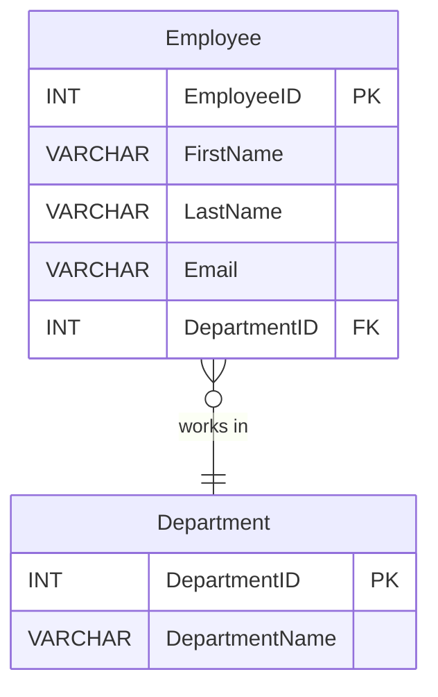
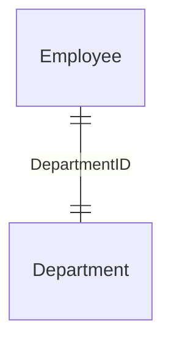
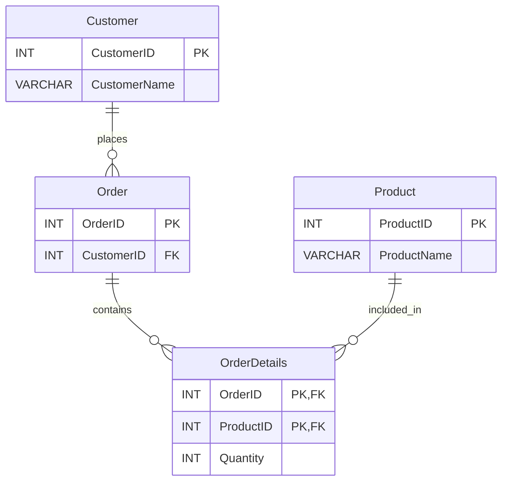

# Comprehensive SQL Guide: Understanding Relationships with Full Examples and Diagrams

---

## Introduction

Structured Query Language (SQL) is the standard language for interacting with relational databases. Understanding how tables relate to each other is crucial for designing efficient and scalable databases. This guide provides a comprehensive overview of SQL, focusing on relationships between tables, complete examples, and visual diagrams using Mermaid to enhance understanding.

---

## Table of Contents

1. [Introduction to SQL and Relational Databases](#1-introduction-to-sql-and-relational-databases)
2. [Data Definition Language (DDL)](#2-data-definition-language-ddl)
   - [2.1 Creating Databases](#21-creating-databases)
   - [2.2 Creating Tables with Relationships](#22-creating-tables-with-relationships)
   - [2.3 Altering Tables and Relationships](#23-altering-tables-and-relationships)
   - [2.4 Dropping Tables and Databases](#24-dropping-tables-and-databases)
3. [Data Manipulation Language (DML)](#3-data-manipulation-language-dml)
   - [3.1 Inserting Data into Related Tables](#31-inserting-data-into-related-tables)
   - [3.2 Updating Data Across Relationships](#32-updating-data-across-relationships)
   - [3.3 Deleting Data with Relationships](#33-deleting-data-with-relationships)
   - [3.4 Selecting Data Using Joins](#34-selecting-data-using-joins)
4. [Advanced Querying and Relationships](#4-advanced-querying-and-relationships)
   - [4.1 Aggregate Functions and Grouping](#41-aggregate-functions-and-grouping)
   - [4.2 Subqueries and Nested Queries](#42-subqueries-and-nested-queries)
   - [4.3 Complex Joins and Relationships](#43-complex-joins-and-relationships)
5. [Transactions and Data Integrity](#5-transactions-and-data-integrity)
6. [Indexes, Constraints, and Relationships](#6-indexes-constraints-and-relationships)
7. [Stored Procedures and Functions](#7-stored-procedures-and-functions)
8. [Triggers and Automatic Relationships Maintenance](#8-triggers-and-automatic-relationships-maintenance)
9. [Views and Virtual Tables](#9-views-and-virtual-tables)
10. [Normalization and Database Design](#10-normalization-and-database-design)
11. [Exercises with Full Examples and Diagrams](#11-exercises-with-full-examples-and-diagrams)
12. [Best Practices](#12-best-practices)
13. [Conclusion](#13-conclusion)
14. [Additional Resources](#14-additional-resources)

---

## 1. Introduction to SQL and Relational Databases

### What is SQL?

SQL (Structured Query Language) is a standard programming language used to manage and manipulate relational databases. It allows you to create, read, update, and delete data.

### Relational Database Concepts

- **Tables**: Store data in rows and columns.
- **Rows (Records)**: Individual entries in a table.
- **Columns (Fields)**: Attributes of the data.
- **Primary Key**: Uniquely identifies each record in a table.
- **Foreign Key**: A field in one table that links to the primary key in another table.
- **Relationships**: Logical connections between tables.

### Types of Relationships

- **One-to-One (1:1)**: A single record in one table is related to a single record in another.
- **One-to-Many (1:N)**: A single record in one table is related to multiple records in another.
- **Many-to-Many (M:N)**: Multiple records in one table are related to multiple records in another.

#### Diagram Representation

```mermaid
erDiagram
    TableA ||--|| TableB : One-to-One
    TableC ||--o{ TableD : One-to-Many
    TableE }o--o{ TableF : Many-to-Many
```

---

## 2. Data Definition Language (DDL)

DDL commands define and modify the structure of the database and its objects.

### 2.1 Creating Databases

#### Syntax

```sql
CREATE DATABASE database_name;
```

#### Example

```sql
CREATE DATABASE CompanyDB;
```

---

### 2.2 Creating Tables with Relationships

#### Defining Tables and Relationships

When creating tables, defining relationships involves specifying primary keys and foreign keys.

#### Example: Employee and Department Tables

##### Creating the Department Table

```sql
CREATE TABLE Department (
    DepartmentID INT PRIMARY KEY,
    DepartmentName VARCHAR(100) NOT NULL UNIQUE
);
```

##### Creating the Employee Table with a Foreign Key Relationship

```sql
CREATE TABLE Employee (
    EmployeeID INT PRIMARY KEY,
    FirstName VARCHAR(50) NOT NULL,
    LastName VARCHAR(50) NOT NULL,
    Email VARCHAR(100),
    DepartmentID INT,
    FOREIGN KEY (DepartmentID) REFERENCES Department(DepartmentID)
);
```

#### Explanation

- **`DepartmentID INT PRIMARY KEY`**: Sets `DepartmentID` as the primary key in the `Department` table.
- **`FOREIGN KEY (DepartmentID) REFERENCES Department(DepartmentID)`**: Establishes a relationship between `Employee` and `Department`.

#### Mermaid Diagram



---

### 2.3 Altering Tables and Relationships

#### Adding a New Table and Establishing Relationships

##### Example: Adding a Project Table and Linking to Employee

```sql
CREATE TABLE Project (
    ProjectID INT PRIMARY KEY,
    ProjectName VARCHAR(100) NOT NULL
);

-- Associative Table for Many-to-Many Relationship
CREATE TABLE EmployeeProject (
    EmployeeID INT,
    ProjectID INT,
    PRIMARY KEY (EmployeeID, ProjectID),
    FOREIGN KEY (EmployeeID) REFERENCES Employee(EmployeeID),
    FOREIGN KEY (ProjectID) REFERENCES Project(ProjectID)
);
```

#### Explanation

- **Many-to-Many Relationship**: An employee can work on multiple projects, and a project can have multiple employees.
- **Associative Table (`EmployeeProject`)**: Contains foreign keys referencing both `Employee` and `Project`.

#### Mermaid Diagram

```mermaid
erDiagram
    Employee ||--o{ EmployeeProject : "assigned to"
    Project  ||--o{ EmployeeProject : "includes"
    Employee {
        INT EmployeeID PK
        ...
    }
    Project {
        INT ProjectID PK
        VARCHAR ProjectName
    }
    EmployeeProject {
        INT EmployeeID PK, FK
        INT ProjectID PK, FK
    }
```

---

### 2.4 Dropping Tables and Databases

#### Dropping Tables with Relationships

Before dropping a table involved in relationships, you may need to drop the foreign key constraints.

##### Example

```sql
ALTER TABLE EmployeeProject
DROP FOREIGN KEY FK_EmployeeProject_Employee;

ALTER TABLE EmployeeProject
DROP FOREIGN KEY FK_EmployeeProject_Project;

DROP TABLE EmployeeProject;
DROP TABLE Employee;
DROP TABLE Project;
DROP TABLE Department;
```

---

## 3. Data Manipulation Language (DML)

DML commands are used to manage data within tables.

### 3.1 Inserting Data into Related Tables

#### Inserting Data into Parent Tables First

##### Example

```sql
-- Insert Departments
INSERT INTO Department (DepartmentID, DepartmentName)
VALUES (1, 'Human Resources'), (2, 'Engineering'), (3, 'Marketing');

-- Insert Employees
INSERT INTO Employee (EmployeeID, FirstName, LastName, Email, DepartmentID)
VALUES
    (101, 'John', 'Doe', 'john.doe@example.com', 2),
    (102, 'Jane', 'Smith', 'jane.smith@example.com', 1),
    (103, 'Emily', 'Jones', 'emily.jones@example.com', 2);

-- Insert Projects
INSERT INTO Project (ProjectID, ProjectName)
VALUES (201, 'Project Apollo'), (202, 'Project Zeus');

-- Assign Employees to Projects
INSERT INTO EmployeeProject (EmployeeID, ProjectID)
VALUES
    (101, 201),
    (101, 202),
    (103, 201);
```

#### Explanation

- **Order of Insertion**: Insert into parent tables (`Department`, `Project`) before child tables (`Employee`, `EmployeeProject`).
- **Employee Assignments**: Employee 101 is assigned to both projects.

---

### 3.2 Updating Data Across Relationships

#### Example: Changing an Employee's Department

```sql
UPDATE Employee
SET DepartmentID = 3
WHERE EmployeeID = 103;
```

#### Explanation

- Employee 103 (`Emily Jones`) is moved to the `Marketing` department.

---

### 3.3 Deleting Data with Relationships

#### Cascading Deletes

To automatically delete related records, you can define `ON DELETE CASCADE` on foreign key constraints.

##### Example

```sql
ALTER TABLE EmployeeProject
DROP FOREIGN KEY EmployeeProject_ibfk_1;

ALTER TABLE EmployeeProject
ADD CONSTRAINT FK_EmployeeProject_Employee
FOREIGN KEY (EmployeeID)
REFERENCES Employee(EmployeeID)
ON DELETE CASCADE;
```

#### Deleting an Employee

```sql
DELETE FROM Employee
WHERE EmployeeID = 101;
```

#### Explanation

- Deleting Employee 101 will automatically remove entries from `EmployeeProject` due to cascading delete.

---

### 3.4 Selecting Data Using Joins

#### Inner Join Example

```sql
SELECT E.FirstName, E.LastName, D.DepartmentName
FROM Employee E
INNER JOIN Department D ON E.DepartmentID = D.DepartmentID;
```

#### Result

| FirstName | LastName | DepartmentName  |
|-----------|----------|-----------------|
| John      | Doe      | Engineering     |
| Jane      | Smith    | Human Resources |
| Emily     | Jones    | Marketing       |

#### Explanation

- **`INNER JOIN`**: Retrieves records where there is a match in both tables.

#### Mermaid Diagram: Join Visualization



---

## 4. Advanced Querying and Relationships

### 4.1 Aggregate Functions and Grouping

#### Example: Count Employees per Department

```sql
SELECT D.DepartmentName, COUNT(E.EmployeeID) AS EmployeeCount
FROM Department D
LEFT JOIN Employee E ON D.DepartmentID = E.DepartmentID
GROUP BY D.DepartmentName;
```

#### Result

| DepartmentName  | EmployeeCount |
|-----------------|---------------|
| Human Resources | 1             |
| Engineering     | 1             |
| Marketing       | 1             |

---

### 4.2 Subqueries and Nested Queries

#### Example: Find Departments with More Than One Employee

```sql
SELECT DepartmentName
FROM Department
WHERE DepartmentID IN (
    SELECT DepartmentID
    FROM Employee
    GROUP BY DepartmentID
    HAVING COUNT(EmployeeID) > 1
);
```

#### Explanation

- **Subquery**: The inner query calculates departments with more than one employee.

---

### 4.3 Complex Joins and Relationships

#### Example: Retrieve Employees and Their Projects

```sql
SELECT E.FirstName, E.LastName, P.ProjectName
FROM Employee E
JOIN EmployeeProject EP ON E.EmployeeID = EP.EmployeeID
JOIN Project P ON EP.ProjectID = P.ProjectID;
```

#### Result

| FirstName | LastName | ProjectName    |
|-----------|----------|----------------|
| John      | Doe      | Project Apollo |
| John      | Doe      | Project Zeus   |
| Emily     | Jones    | Project Apollo |

---

## 5. Transactions and Data Integrity

#### Example: Transferring an Employee Between Projects

```sql
BEGIN TRANSACTION;

-- Remove from current project
DELETE FROM EmployeeProject
WHERE EmployeeID = 103 AND ProjectID = 201;

-- Add to new project
INSERT INTO EmployeeProject (EmployeeID, ProjectID)
VALUES (103, 202);

COMMIT;
```

#### Explanation

- **Atomicity**: Ensures both operations succeed together.

---

## 6. Indexes, Constraints, and Relationships

### Creating Indexes to Improve Query Performance

```sql
CREATE INDEX idx_DepartmentName ON Department (DepartmentName);
CREATE INDEX idx_EmployeeLastName ON Employee (LastName);
```

### Adding Constraints for Data Integrity

```sql
ALTER TABLE Employee
ADD CONSTRAINT chk_Email CHECK (Email LIKE '%@%.%');

ALTER TABLE EmployeeProject
ADD CONSTRAINT pk_EmployeeProject PRIMARY KEY (EmployeeID, ProjectID);
```

---

## 7. Stored Procedures and Functions

#### Example: Stored Procedure to Get Employee Projects

```sql
DELIMITER //

CREATE PROCEDURE GetEmployeeProjects (IN empID INT)
BEGIN
    SELECT E.FirstName, E.LastName, P.ProjectName
    FROM Employee E
    JOIN EmployeeProject EP ON E.EmployeeID = EP.EmployeeID
    JOIN Project P ON EP.ProjectID = P.ProjectID
    WHERE E.EmployeeID = empID;
END //

DELIMITER ;
```

#### Calling the Stored Procedure

```sql
CALL GetEmployeeProjects(101);
```

---

## 8. Triggers and Automatic Relationships Maintenance

#### Example: Trigger to Log Deletions

```sql
CREATE TABLE EmployeeDeletionLog (
    EmployeeID INT,
    DeletionDate DATETIME,
    Reason VARCHAR(255)
);

DELIMITER //

CREATE TRIGGER trg_EmployeeDeletion
AFTER DELETE ON Employee
FOR EACH ROW
BEGIN
    INSERT INTO EmployeeDeletionLog (EmployeeID, DeletionDate, Reason)
    VALUES (OLD.EmployeeID, NOW(), 'Employee record deleted');
END //

DELIMITER ;
```

#### Explanation

- **Trigger**: Automatically logs when an employee is deleted.

---

## 9. Views and Virtual Tables

#### Example: Creating a View for Employee Details

```sql
CREATE VIEW EmployeeDetails AS
SELECT E.EmployeeID, E.FirstName, E.LastName, D.DepartmentName
FROM Employee E
LEFT JOIN Department D ON E.DepartmentID = D.DepartmentID;
```

#### Querying the View

```sql
SELECT * FROM EmployeeDetails;
```

---

## 10. Normalization and Database Design

### First Normal Form (1NF)

- **Eliminate Repeating Groups**: Ensure each field contains atomic values.

### Second Normal Form (2NF)

- **Eliminate Redundant Data**: Remove data that applies to multiple rows.

### Third Normal Form (3NF)

- **Eliminate Columns Not Dependent on Primary Key**: Ensure all attributes depend only on the primary key.

#### Example: Normalizing an Order System

##### Initial Unnormalized Table

| OrderID | CustomerName | ProductID | ProductName | Quantity |
|---------|--------------|-----------|-------------|----------|
| 1       | Alice Smith  | 101       | Widget      | 5        |
| 1       | Alice Smith  | 102       | Gizmo       | 2        |
| 2       | Bob Johnson  | 103       | Thingamajig | 1        |

##### Normalized Tables

1. **Customer Table**

   | CustomerID | CustomerName |
   |------------|--------------|
   | 1          | Alice Smith  |
   | 2          | Bob Johnson  |

2. **Product Table**

   | ProductID | ProductName  |
   |-----------|--------------|
   | 101       | Widget       |
   | 102       | Gizmo        |
   | 103       | Thingamajig  |

3. **Order Table**

   | OrderID | CustomerID |
   |---------|------------|
   | 1       | 1          |
   | 2       | 2          |

4. **OrderDetails Table**

   | OrderID | ProductID | Quantity |
   |---------|-----------|----------|
   | 1       | 101       | 5        |
   | 1       | 102       | 2        |
   | 2       | 103       | 1        |

#### Mermaid Diagram



---

## 11. Exercises with Full Examples and Diagrams

### Exercise 1: University Database

#### Task

Design a database for a university system with the following requirements:

- **Entities**:
  - **Students**
  - **Courses**
  - **Enrollments**

- **Relationships**:
  - A student can enroll in many courses.
  - A course can have many students.

#### Steps

1. **Create Tables**:

   - **Student Table**

     ```sql
     CREATE TABLE Student (
         StudentID INT PRIMARY KEY,
         FirstName VARCHAR(50),
         LastName VARCHAR(50),
         Email VARCHAR(100)
     );
     ```

   - **Course Table**

     ```sql
     CREATE TABLE Course (
         CourseID INT PRIMARY KEY,
         CourseName VARCHAR(100),
         Credits INT
     );
     ```

   - **Enrollment Table** (Associative Table)

     ```sql
     CREATE TABLE Enrollment (
         StudentID INT,
         CourseID INT,
         EnrollmentDate DATE,
         PRIMARY KEY (StudentID, CourseID),
         FOREIGN KEY (StudentID) REFERENCES Student(StudentID),
         FOREIGN KEY (CourseID) REFERENCES Course(CourseID)
     );
     ```

2. **Insert Sample Data**:

   - **Students**

     ```sql
     INSERT INTO Student (StudentID, FirstName, LastName, Email)
     VALUES
         (1, 'Alice', 'Johnson', 'alice.johnson@example.com'),
         (2, 'Bob', 'Smith', 'bob.smith@example.com');
     ```

   - **Courses**

     ```sql
     INSERT INTO Course (CourseID, CourseName, Credits)
     VALUES
         (101, 'Database Systems', 3),
         (102, 'Operating Systems', 4);
     ```

   - **Enrollments**

     ```sql
     INSERT INTO Enrollment (StudentID, CourseID, EnrollmentDate)
     VALUES
         (1, 101, '2023-09-01'),
         (1, 102, '2023-09-01'),
         (2, 101, '2023-09-01');
     ```

3. **Query Data**:

   - **List all students and their courses**

     ```sql
     SELECT S.FirstName, S.LastName, C.CourseName
     FROM Student S
     JOIN Enrollment E ON S.StudentID = E.StudentID
     JOIN Course C ON E.CourseID = C.CourseID;
     ```

     **Result**

     | FirstName | LastName | CourseName      |
     |-----------|----------|-----------------|
     | Alice     | Johnson  | Database Systems|
     | Alice     | Johnson  | Operating Systems|
     | Bob       | Smith    | Database Systems|

4. **Diagram**

   ```mermaid
   erDiagram
       Student ||--o{ Enrollment : enrolls_in
       Course  ||--o{ Enrollment : includes
       Student {
           INT StudentID PK
           VARCHAR FirstName
           VARCHAR LastName
           VARCHAR Email
       }
       Course {
           INT CourseID PK
           VARCHAR CourseName
           INT Credits
       }
       Enrollment {
           INT StudentID PK, FK
           INT CourseID PK, FK
           DATE EnrollmentDate
       }
   ```

---

### Exercise 2: Online Store Database

#### Task

Design a database for an online store with the following requirements:

- **Entities**:
  - **Customers**
  - **Products**
  - **Orders**
  - **OrderItems**

- **Relationships**:
  - A customer can place many orders.
  - An order can include many products.
  - A product can be in many orders.

#### Steps

1. **Create Tables**:

   - **Customer**

     ```sql
     CREATE TABLE Customer (
         CustomerID INT PRIMARY KEY,
         FirstName VARCHAR(50),
         LastName VARCHAR(50),
         Email VARCHAR(100)
     );
     ```

   - **Product**

     ```sql
     CREATE TABLE Product (
         ProductID INT PRIMARY KEY,
         ProductName VARCHAR(100),
         Price DECIMAL(10, 2)
     );
     ```

   - **Order**

     ```sql
     CREATE TABLE OrderTable (
         OrderID INT PRIMARY KEY,
         CustomerID INT,
         OrderDate DATE,
         FOREIGN KEY (CustomerID) REFERENCES Customer(CustomerID)
     );
     ```

   - **OrderItem**

     ```sql
     CREATE TABLE OrderItem (
         OrderID INT,
         ProductID INT,
         Quantity INT,
         PRIMARY KEY (OrderID, ProductID),
         FOREIGN KEY (OrderID) REFERENCES OrderTable(OrderID),
         FOREIGN KEY (ProductID) REFERENCES Product(ProductID)
     );
     ```

2. **Insert Sample Data**:

   - **Customers**

     ```sql
     INSERT INTO Customer (CustomerID, FirstName, LastName, Email)
     VALUES
         (1, 'Carol', 'Danvers', 'carol.danvers@example.com'),
         (2, 'Peter', 'Parker', 'peter.parker@example.com');
     ```

   - **Products**

     ```sql
     INSERT INTO Product (ProductID, ProductName, Price)
     VALUES
         (1001, 'Laptop', 999.99),
         (1002, 'Smartphone', 499.99);
     ```

   - **Orders**

     ```sql
     INSERT INTO OrderTable (OrderID, CustomerID, OrderDate)
     VALUES
         (5001, 1, '2023-10-10'),
         (5002, 2, '2023-10-11');
     ```

   - **OrderItems**

     ```sql
     INSERT INTO OrderItem (OrderID, ProductID, Quantity)
     VALUES
         (5001, 1001, 1),
         (5001, 1002, 2),
         (5002, 1002, 1);
     ```

3. **Query Data**:

   - **Retrieve Orders with Customer and Product Details**

     ```sql
     SELECT O.OrderID, C.FirstName, C.LastName, P.ProductName, OI.Quantity
     FROM OrderTable O
     JOIN Customer C ON O.CustomerID = C.CustomerID
     JOIN OrderItem OI ON O.OrderID = OI.OrderID
     JOIN Product P ON OI.ProductID = P.ProductID;
     ```

     **Result**

     | OrderID | FirstName | LastName | ProductName | Quantity |
     |---------|-----------|----------|-------------|----------|
     | 5001    | Carol     | Danvers  | Laptop      | 1        |
     | 5001    | Carol     | Danvers  | Smartphone  | 2        |
     | 5002    | Peter     | Parker   | Smartphone  | 1        |

4. **Diagram**

   ```mermaid
   erDiagram
       Customer ||--o{ OrderTable : places
       OrderTable ||--o{ OrderItem : contains
       Product ||--o{ OrderItem : included_in
       Customer {
           INT CustomerID PK
           VARCHAR FirstName
           VARCHAR LastName
           VARCHAR Email
       }
       OrderTable {
           INT OrderID PK
           INT CustomerID FK
           DATE OrderDate
       }
       Product {
           INT ProductID PK
           VARCHAR ProductName
           DECIMAL Price
       }
       OrderItem {
           INT OrderID PK, FK
           INT ProductID PK, FK
           INT Quantity
       }
   ```

---

## 12. Best Practices

- **Use Consistent Naming Conventions**: For tables, columns, and constraints.
- **Normalize Data**: To reduce redundancy and improve data integrity.
- **Define Primary and Foreign Keys**: To establish clear relationships.
- **Use Indexes Wisely**: To optimize query performance.
- **Implement Constraints**: Such as `NOT NULL`, `UNIQUE`, and `CHECK` for data validation.
- **Use Transactions**: To maintain data integrity during multiple related operations.
- **Document Your Database**: Including ER diagrams and schema descriptions.

---

## 13. Conclusion

Understanding relationships in SQL is fundamental for designing robust and efficient databases. By defining clear relationships and utilizing primary and foreign keys, you can ensure data integrity and facilitate complex queries. Diagrams, such as ER diagrams, are invaluable tools for visualizing and planning your database structure.

This guide has covered:

- Creating tables with relationships.
- Manipulating data across related tables.
- Querying data using joins.
- Designing databases using normalization principles.
- Providing full examples with diagrams to illustrate concepts.

---

## 14. Additional Resources

- **Online Tutorials**:
  - [W3Schools SQL Tutorial](https://www.w3schools.com/sql/)
  - [SQLBolt Interactive Lessons](https://sqlbolt.com/)
- **Books**:
  - *Database System Concepts* by Abraham Silberschatz
  - *SQL Queries for Mere Mortals* by John L. Viescas
- **Tools for Diagramming**:
  - [Mermaid Live Editor](https://mermaid-js.github.io/mermaid-live-editor)
  - [dbdiagram.io](https://dbdiagram.io/)
- **Official Documentation**:
  - [MySQL Reference Manual](https://dev.mysql.com/doc/)
  - [PostgreSQL Documentation](https://www.postgresql.org/docs/)
  - [Microsoft SQL Server Documentation](https://docs.microsoft.com/en-us/sql/)

---

**End of Guide**

---

*Note: Practice by setting up a database environment and implementing the examples provided. Visualizing your database with diagrams will greatly enhance your understanding of relationships in SQL.*
