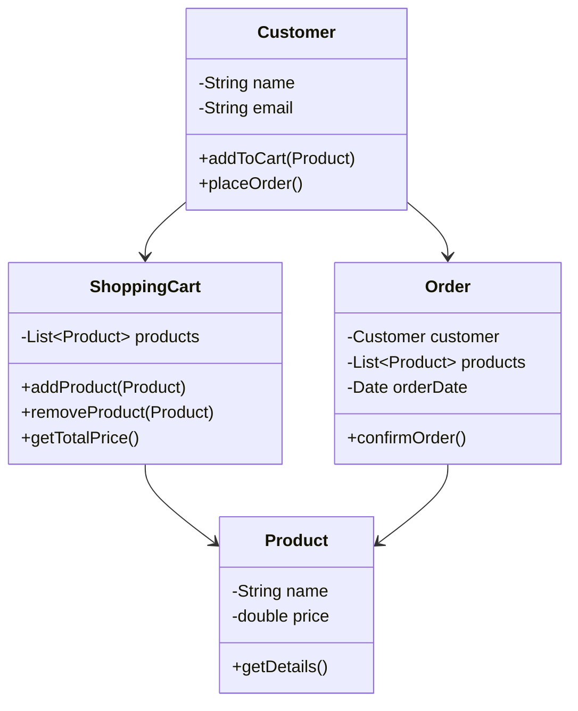
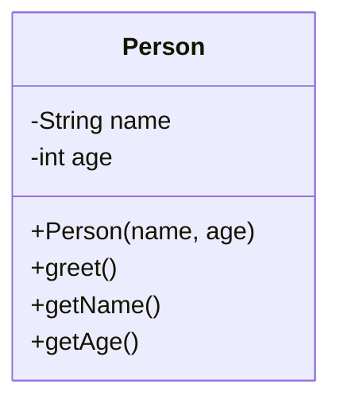
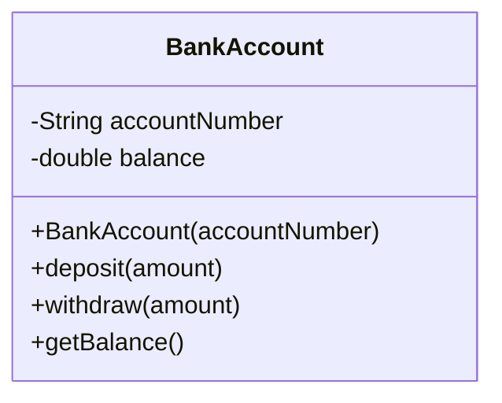
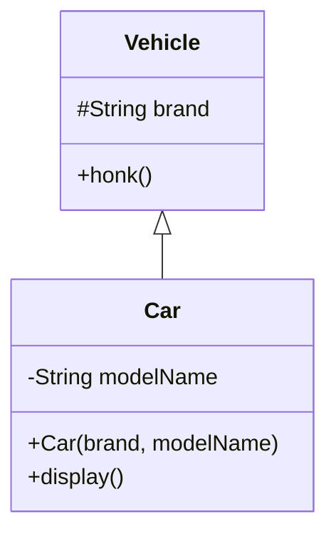
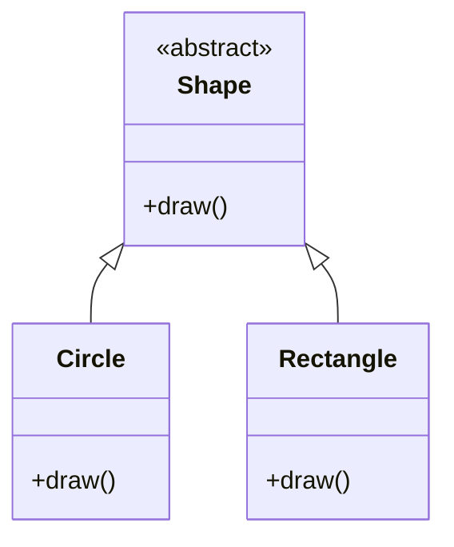
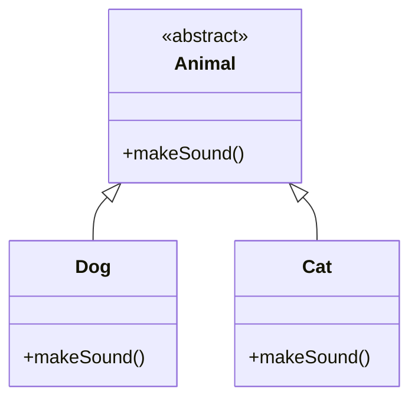
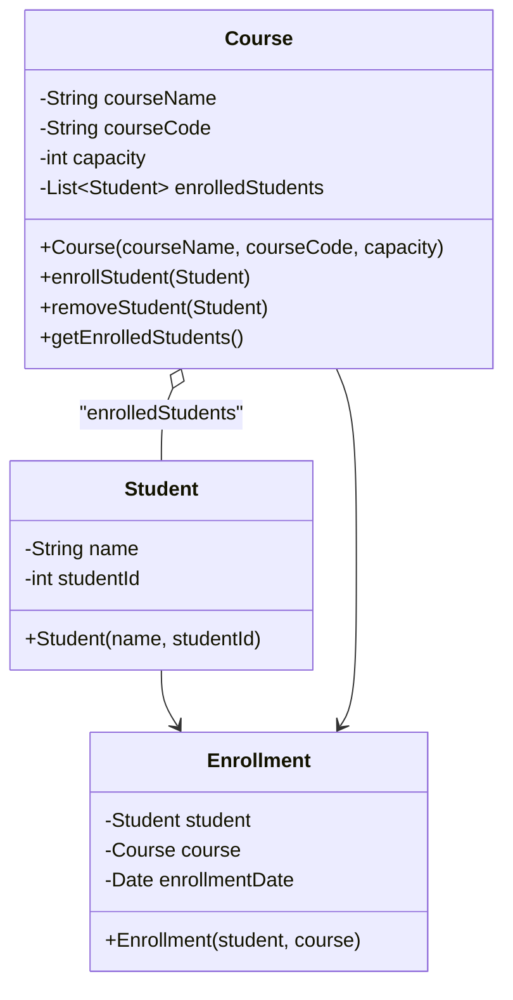

# **Teaching Object-Oriented Programming (OOP) in Java**

Teaching OOP in Java for the first time is an exciting endeavor. This comprehensive guide is designed to provide you with all the necessary information, examples, and visual aids to effectively teach OOP concepts using Java. The focus is on real-world use cases, code examples, and UML diagrams created with Mermaid syntax to deliver concepts clearly and engagingly.

---

## **Table of Contents**

1. [Introduction to OOP with Real-World Use Cases](#1-introduction-to-oop-with-real-world-use-cases)
2. [Setting Up the Development Environment](#2-setting-up-the-development-environment)
3. [Basic Java Syntax and Structures](#3-basic-java-syntax-and-structures)
4. [Classes and Objects](#4-classes-and-objects)
5. [Encapsulation](#5-encapsulation)
6. [Inheritance](#6-inheritance)
7. [Polymorphism](#7-polymorphism)
8. [Abstraction](#8-abstraction)
9. [Packages and Access Control](#9-packages-and-access-control)
10. [Exception Handling](#10-exception-handling)
11. [Collections Framework](#11-collections-framework)
12. [Input/Output Streams](#12-inputoutput-streams)
13. [Practical Application Development](#13-practical-application-development)
14. [Best Practices](#14-best-practices)
15. [Additional Resources](#15-additional-resources)
16. [Teaching Tips with Visual Aids](#16-teaching-tips-with-visual-aids)
17. [Common Pitfalls to Avoid](#17-common-pitfalls-to-avoid)
18. [Final Notes](#18-final-notes)

---

## **1. Introduction to OOP with Real-World Use Cases**

### **What is Object-Oriented Programming (OOP)?**

Object-Oriented Programming (OOP) is a programming paradigm centered around the concept of "objects," which are instances of classes. These objects encapsulate data and behavior, making code more modular, reusable, and easier to maintain.

### **Why Use OOP?**

- **Modularity:** Break down complex problems into manageable pieces.
- **Reusability:** Use existing code without modification.
- **Maintainability:** Easier to update and fix code.
- **Abstraction:** Focus on essential qualities rather than specific details.

### **Core Principles of OOP**

1. **Encapsulation:** Bundling data and methods that operate on the data within one unit (class).
2. **Inheritance:** Mechanism where a new class inherits properties and behavior from an existing class.
3. **Polymorphism:** Ability to process objects differently based on their data type or class.
4. **Abstraction:** Hiding complex implementation details and showing only the necessary features.

### **Real-World Use Case: Online Shopping System**

**Scenario:** Designing an online shopping platform like Amazon.

- **Objects:**
  - **Customer:** Represents users who shop on the platform.
  - **Product:** Items available for purchase.
  - **ShoppingCart:** Temporary storage for products a customer intends to buy.
  - **Order:** Represents a confirmed purchase.

**Interaction Flow:**

1. A **Customer** browses **Products**.
2. Adds **Products** to the **ShoppingCart**.
3. Proceeds to checkout and places an **Order**.

### **Mermaid UML Class Diagram**



**Explanation:**

- **Classes and Attributes:**
  - `Customer` has `name` and `email`.
  - `Product` has `name` and `price`.
  - `ShoppingCart` contains a list of `Product` objects.
  - `Order` includes `Customer`, list of `Product`s, and `orderDate`.
- **Relationships:**
  - `Customer` interacts with `ShoppingCart` and `Order`.
  - `ShoppingCart` manages `Product`s.
  - `Order` is associated with both `Customer` and `Product`s.

This use case introduces students to the concept of modeling real-world entities as classes and their interactions as methods and relationships.

---

## **2. Setting Up the Development Environment**

Before diving into coding, it's essential to set up a proper development environment.

### **Java Development Kit (JDK)**

- **What is JDK?**
  - A software development environment used for developing Java applications.
- **Installation Steps:**
  1. Visit the [Oracle JDK Downloads](https://www.oracle.com/java/technologies/javase-downloads.html) page.
  2. Download the appropriate version for your operating system.
  3. Follow the installation instructions.

### **Integrated Development Environment (IDE)**

An IDE integrates all necessary tools for software development.

- **Recommended IDEs:**
  - **IntelliJ IDEA Community Edition:** User-friendly and feature-rich.
  - **Eclipse IDE:** Widely used, especially in enterprise environments.
  - **NetBeans IDE:** Good for beginners with built-in tools.

### **Hello World Program**

Writing a simple program to ensure everything is set up correctly.

```java
public class HelloWorld {
    public static void main(String[] args) {
        System.out.println("Hello, World!");
    }
}
```

**Explanation:**

- **`public class HelloWorld`:** Defines a class named `HelloWorld`.
- **`public static void main(String[] args)`:** The entry point of the application.
- **`System.out.println("Hello, World!");`:** Prints the text to the console.

**Steps to Run:**

1. Open your IDE and create a new Java project.
2. Create a new Java class named `HelloWorld`.
3. Copy the code into the class file.
4. Run the program. You should see `Hello, World!` printed in the console.

---

## **3. Basic Java Syntax and Structures**

Understanding the basic building blocks of Java is crucial before delving into OOP concepts.

### **Variables and Data Types**

#### **Primitive Data Types**

- **Integer Types:**
  - `byte`: 8-bit
  - `short`: 16-bit
  - `int`: 32-bit
  - `long`: 64-bit
- **Floating-Point Types:**
  - `float`: Single precision
  - `double`: Double precision
- **Other Types:**
  - `char`: 16-bit Unicode character
  - `boolean`: `true` or `false`

**Examples:**

```java
int age = 25;
double price = 19.99;
char grade = 'A';
boolean isAvailable = true;
```

#### **Reference Types**

- **Strings:** Objects that represent sequences of characters.

**Example:**

```java
String name = "Alice";
```

### **Operators and Expressions**

- **Arithmetic Operators:** `+`, `-`, `*`, `/`, `%`
- **Assignment Operators:** `=`, `+=`, `-=`, `*=`, `/=`, `%=`
- **Comparison Operators:** `==`, `!=`, `>`, `<`, `>=`, `<=`
- **Logical Operators:** `&&`, `||`, `!`

**Example:**

```java
int sum = 10 + 20;          // sum is 30
boolean isEqual = (sum == 30); // isEqual is true
```

### **Control Flow Statements**

#### **Conditional Statements**

- **`if` Statement:**

  ```java
  if (condition) {
      // Code to execute if condition is true
  }
  ```

- **`if-else` Statement:**

  ```java
  if (condition) {
      // Code if true
  } else {
      // Code if false
  }
  ```

- **`switch` Statement:**

  ```java
  switch (variable) {
      case value1:
          // Code block
          break;
      case value2:
          // Code block
          break;
      default:
          // Default code block
  }
  ```

#### **Loops**

- **`for` Loop:**

  ```java
  for (int i = 0; i < 10; i++) {
      System.out.println(i);
  }
  ```

- **`while` Loop:**

  ```java
  int i = 0;
  while (i < 10) {
      System.out.println(i);
      i++;
  }
  ```

- **`do-while` Loop:**

  ```java
  int i = 0;
  do {
      System.out.println(i);
      i++;
  } while (i < 10);
  ```

### **Arrays**

An array is a container object that holds a fixed number of values of a single type.

**Example:**

```java
int[] numbers = new int[5]; // Declaration of an integer array of size 5
numbers[0] = 10;
numbers[1] = 20;
// and so on
```

**Enhanced For Loop:**

```java
for (int num : numbers) {
    System.out.println(num);
}
```

---

## **4. Classes and Objects**

Classes and objects are fundamental concepts in OOP.

### **Defining a Class**

A class is a blueprint for creating objects.

**Example: `Person` Class**

```java
public class Person {
    // Attributes (Fields)
    private String name;
    private int age;

    // Constructor
    public Person(String name, int age) {
        this.name = name;
        this.age = age;
    }
    
    // Methods
    public void greet() {
        System.out.println("Hello, my name is " + name);
    }

    // Getters and Setters (if needed)
    public String getName() {
        return name;
    }

    public int getAge() {
        return age;
    }

    // You can also add setters if you need to modify the fields
}
```

**Explanation:**

- **Fields:** Variables that hold the state of an object (`name` and `age`).
- **Constructor:** Special method used to initialize new objects.
- **Methods:** Define the behavior of the objects (`greet()`).

### **Mermaid UML Class Diagram**



### **Creating Objects**

To use a class, you create objects (instances of the class).

**Example:**

```java
public class Main {
    public static void main(String[] args) {
        Person person1 = new Person("Alice", 30);
        person1.greet(); // Outputs: Hello, my name is Alice

        Person person2 = new Person("Bob", 25);
        person2.greet(); // Outputs: Hello, my name is Bob
    }
}
```

**Explanation:**

- **`new Person("Alice", 30);`:** Creates a new `Person` object.
- **`person1.greet();`:** Calls the `greet` method on the `person1` object.

---

## **5. Encapsulation**

Encapsulation is the mechanism of restricting access to certain components of an object.

### **Why Encapsulation?**

- **Data Hiding:** Protect internal object state.
- **Control Access:** Provide controlled access through methods.
- **Flexibility:** Change implementation without affecting external code.

### **Use Case: Bank Account Management**

**Scenario:** Protecting sensitive data like account balance and account number.

**`BankAccount` Class Example:**

```java
public class BankAccount {
    // Private fields
    private String accountNumber;
    private double balance;

    // Constructor
    public BankAccount(String accountNumber) {
        this.accountNumber = accountNumber;
        balance = 0.0;
    }

    // Public methods to access and modify the private fields
    public void deposit(double amount) {
        if (amount > 0) {
            balance += amount;
            System.out.println("Deposited $" + amount);
        } else {
            System.out.println("Invalid amount.");
        }
    }

    public void withdraw(double amount) {
        if (amount > 0 && amount <= balance) {
            balance -= amount;
            System.out.println("Withdrew $" + amount);
        } else {
            System.out.println("Insufficient funds or invalid amount.");
        }
    }

    public double getBalance() {
        return balance;
    }

    // No setter for balance to prevent unauthorized modification
}
```

### **Mermaid UML Class Diagram**



**Explanation:**

- **Private Fields:** `accountNumber` and `balance` are private.
- **Public Methods:** `deposit`, `withdraw`, and `getBalance` control access.
- **No Public Setter for Balance:** Prevents external modification of `balance` without validation.

### **Using the `BankAccount` Class**

```java
public class Main {
    public static void main(String[] args) {
        BankAccount account = new BankAccount("123456789");
        account.deposit(500.0);        // Deposited $500.0
        account.withdraw(200.0);       // Withdrew $200.0
        System.out.println("Balance: $" + account.getBalance()); // Balance: $300.0
    }
}
```

---

## **6. Inheritance**

Inheritance allows a new class to acquire the properties and methods of an existing class.

### **Why Use Inheritance?**

- **Code Reusability:** Avoid code duplication.
- **Hierarchical Classifications:** Model real-world relationships.

### **Use Case: Vehicle Hierarchy**

**Scenario:** Modeling different types of vehicles.

**Superclass `Vehicle`:**

```java
public class Vehicle {
    protected String brand;
    
    public void honk() {
        System.out.println("Beep beep!");
    }
}
```

**Subclass `Car`:**

```java
public class Car extends Vehicle {
    private String modelName;
    
    public Car(String brand, String modelName) {
        this.brand = brand;            // Inherited field
        this.modelName = modelName;
    }
    
    public void display() {
        System.out.println("Brand: " + brand + ", Model: " + modelName);
    }
}
```

### **Mermaid UML Class Diagram**



**Explanation:**

- **`extends` Keyword:** `Car` extends `Vehicle`, inheriting its fields and methods.
- **Protected Fields:** `brand` is `protected`, accessible in subclasses.
- **Overriding Methods:** Subclasses can override methods from the superclass.

### **Using the `Car` Class**

```java
public class Main {
    public static void main(String[] args) {
        Car car = new Car("Toyota", "Corolla");
        car.honk();      // Inherited method: Beep beep!
        car.display();   // Outputs: Brand: Toyota, Model: Corolla
    }
}
```

---

## **7. Polymorphism**

Polymorphism allows objects to be treated as instances of their parent class rather than their actual class.

### **Types of Polymorphism**

1. **Compile-Time (Static) Polymorphism:** Method overloading.
2. **Runtime (Dynamic) Polymorphism:** Method overriding.

### **Why Use Polymorphism?**

- **Flexibility:** Write code that works with superclass types but behaves differently based on the subclass.
- **Extensibility:** Add new subclasses without changing existing code.

### **Use Case: Shape Drawing Application**

**Abstract `Shape` Class:**

```java
public abstract class Shape {
    public abstract void draw();
}
```

**Concrete Subclasses:**

```java
public class Circle extends Shape {
    public void draw() {
        System.out.println("Drawing a circle.");
    }
}

public class Rectangle extends Shape {
    public void draw() {
        System.out.println("Drawing a rectangle.");
    }
}
```

### **Mermaid UML Class Diagram**



**Explanation:**

- **Abstract Method `draw()`:** Must be implemented by subclasses.
- **Polymorphic Behavior:** Calling `draw()` on a `Shape` reference invokes the appropriate method.

### **Using Polymorphism**

```java
public class Main {
    public static void main(String[] args) {
        Shape shape1 = new Circle();
        Shape shape2 = new Rectangle();

        shape1.draw(); // Outputs: Drawing a circle.
        shape2.draw(); // Outputs: Drawing a rectangle.
    }
}
```

**Explanation:**

- **Shape References:** Both `shape1` and `shape2` are of type `Shape`.
- **Dynamic Method Dispatch:** The JVM calls the overridden `draw()` method based on the actual object's class.

---

## **8. Abstraction**

Abstraction involves hiding the complex reality while exposing only the necessary parts.

### **Why Use Abstraction?**

- **Simplification:** Reduce programming complexity.
- **Focus:** Emphasize what an object does, not how it does it.

### **Abstraction through Abstract Classes and Interfaces**

- **Abstract Classes:** Cannot be instantiated; may contain abstract methods.
- **Interfaces:** Define methods that a class must implement.

### **Use Case: Animal Behavior Simulation**

**Abstract `Animal` Class:**

```java
public abstract class Animal {
    public abstract void makeSound();
}
```

**Concrete Subclasses:**

```java
public class Dog extends Animal {
    public void makeSound() {
        System.out.println("Woof!");
    }
}

public class Cat extends Animal {
    public void makeSound() {
        System.out.println("Meow!");
    }
}
```

### **Mermaid UML Class Diagram**



### **Using the `Animal` Classes**

```java
public class Main {
    public static void main(String[] args) {
        Animal animal1 = new Dog();
        Animal animal2 = new Cat();

        animal1.makeSound(); // Outputs: Woof!
        animal2.makeSound(); // Outputs: Meow!
    }
}
```

**Explanation:**

- **Abstraction:** The `Animal` class provides a template for `makeSound`.
- **Implementation:** Each subclass provides its own implementation of `makeSound`.

---

## **9. Packages and Access Control**

Packages help organize classes and control access.

### **Packages**

- **Purpose:** Group related classes and interfaces.
- **Syntax:** `package packageName;`

**Example:**

```java
package com.library.books;

public class Book {
    // Class code
}
```

### **Creating Packages**

- **Folder Structure:** Follows the package name.
  - `com/library/books/Book.java`

### **Access Modifiers**

1. **`public`:** Accessible from any other class.
2. **`protected`:** Accessible within the same package and subclasses.
3. **`default` (no modifier):** Accessible within the same package.
4. **`private`:** Accessible only within the declared class.

### **Use Case: Organizing a Library System**

**Package Structure:**

- `com.library.books`
- `com.library.members`
- `com.library.transactions`

**Example Classes:**

- **`Book` Class in `com.library.books`:**

  ```java
  package com.library.books;

  public class Book {
      private String title;
      private String author;

      // Constructors, getters, setters
  }
  ```

- **`Member` Class in `com.library.members`:**

  ```java
  package com.library.members;

  public class Member {
      private String name;
      private String memberId;

      // Constructors, getters, setters
  }
  ```

### **Importing Classes**

- **Syntax:** `import packageName.ClassName;`

**Example:**

```java
import com.library.books.Book;
import com.library.members.Member;
```

---

## **10. Exception Handling**

Exceptions are events that disrupt the normal flow of the program.

### **Why Handle Exceptions?**

- **Robustness:** Prevents the program from crashing unexpectedly.
- **User Experience:** Provides meaningful feedback to the user.

### **Exception Types**

1. **Checked Exceptions:** Must be either caught or declared in the method's `throws` clause.
2. **Unchecked Exceptions:** Runtime exceptions that don't need to be declared or caught.

### **Handling Exceptions**

- **`try-catch-finally` Blocks:**

  ```java
  try {
      // Code that might throw an exception
  } catch (ExceptionType e) {
      // Handle exception
  } finally {
      // Code that always executes
  }
  ```

### **Use Case: User Input Validation**

**`DivisionCalculator` Example:**

```java
import java.util.Scanner;

public class DivisionCalculator {
    public static void main(String[] args) {
        Scanner scanner = new Scanner(System.in);
        try {
            System.out.print("Enter dividend: ");
            int dividend = Integer.parseInt(scanner.nextLine());

            System.out.print("Enter divisor: ");
            int divisor = Integer.parseInt(scanner.nextLine());

            int result = divide(dividend, divisor);
            System.out.println("Result: " + result);
        } catch (NumberFormatException e) {
            System.out.println("Please enter valid integers.");
        } catch (ArithmeticException e) {
            System.out.println("Cannot divide by zero.");
        } finally {
            scanner.close();
        }
    }

    public static int divide(int a, int b) {
        return a / b;
    }
}
```

**Explanation:**

- **`NumberFormatException`:** Thrown when parsing invalid integers.
- **`ArithmeticException`:** Thrown when dividing by zero.
- **`finally` Block:** Ensures resources like `Scanner` are closed.

### **Custom Exceptions**

You can create your own exception classes.

**Example:**

```java
public class InsufficientFundsException extends Exception {
    public InsufficientFundsException(String message) {
        super(message);
    }
}
```

**Using Custom Exception:**

```java
public void withdraw(double amount) throws InsufficientFundsException {
    if (amount > balance) {
        throw new InsufficientFundsException("Insufficient funds for withdrawal.");
    } else {
        balance -= amount;
    }
}
```

---

## **11. Collections Framework**

The Collections Framework provides data structures to store and manipulate groups of objects.

### **Common Interfaces and Classes**

- **List Interface:**
  - **Classes:** `ArrayList`, `LinkedList`
- **Set Interface:**
  - **Classes:** `HashSet`, `TreeSet`
- **Map Interface:**
  - **Classes:** `HashMap`, `TreeMap`

### **Using `ArrayList`**

**Example:**

```java
import java.util.ArrayList;

public class StudentList {
    public static void main(String[] args) {
        ArrayList<String> students = new ArrayList<>();

        // Adding elements
        students.add("Alice");
        students.add("Bob");
        students.add("Charlie");

        // Accessing elements
        System.out.println("First student: " + students.get(0));

        // Iterating over the list
        for (String student : students) {
            System.out.println(student);
        }

        // Removing an element
        students.remove("Bob");
    }
}
```

**Explanation:**

- **Generics `<String>`:** Specifies that the `ArrayList` contains `String` objects.
- **Methods:**
  - `add()`: Adds an element.
  - `get()`: Retrieves an element by index.
  - `remove()`: Removes an element.

---

## **12. Input/Output Streams**

Java provides I/O streams for reading from and writing to data sources.

### **Reading from a File**

**Example:**

```java
import java.io.BufferedReader;
import java.io.FileReader;
import java.io.IOException;

public class ReadFileExample {
    public static void main(String[] args) {
        String filePath = "example.txt";
        try (BufferedReader br = new BufferedReader(new FileReader(filePath))) {
            String line;
            while ((line = br.readLine()) != null) {
                System.out.println(line);
            }
        } catch (IOException e) {
            e.printStackTrace();
        }
    }
}
```

### **Writing to a File**

**Example:**

```java
import java.io.BufferedWriter;
import java.io.FileWriter;
import java.io.IOException;

public class WriteFileExample {
    public static void main(String[] args) {
        String filePath = "output.txt";
        try (BufferedWriter bw = new BufferedWriter(new FileWriter(filePath))) {
            bw.write("Hello, World!");
            bw.newLine();
            bw.write("This is a new line.");
        } catch (IOException e) {
            e.printStackTrace();
        }
    }
}
```

### **Serialization**

Serialization is the process of converting an object into a byte stream.

**Example:**

```java
import java.io.Serializable;

public class Student implements Serializable {
    private String name;
    private int age;

    // Constructors, getters, setters
}
```

**Saving an Object:**

```java
import java.io.FileOutputStream;
import java.io.ObjectOutputStream;

public class SerializeExample {
    public static void main(String[] args) {
        Student student = new Student("Alice", 20);
        try (ObjectOutputStream oos = new ObjectOutputStream(new FileOutputStream("student.ser"))) {
            oos.writeObject(student);
        } catch (Exception e) {
            e.printStackTrace();
        }
    }
}
```

**Loading an Object:**

```java
import java.io.FileInputStream;
import java.io.ObjectInputStream;

public class DeserializeExample {
    public static void main(String[] args) {
        try (ObjectInputStream ois = new ObjectInputStream(new FileInputStream("student.ser"))) {
            Student student = (Student) ois.readObject();
            System.out.println("Name: " + student.getName());
        } catch (Exception e) {
            e.printStackTrace();
        }
    }
}
```

---

## **13. Practical Application Development**

Applying concepts through a real-world project solidifies understanding.

### **Project: Student Management System**

#### **Requirements**

- **Classes:**
  - `Student`
  - `Course`
  - `Enrollment`
- **Features:**
  - Enroll students in courses.
  - Display course lists and enrolled students.
  - Handle exceptions (e.g., enrolling in a full course).

#### **Class Definitions**

**`Student` Class:**

```java
public class Student {
    private String name;
    private int studentId;

    // Constructor, getters, setters
}
```

**`Course` Class:**

```java
public class Course {
    private String courseName;
    private String courseCode;
    private int capacity;
    private List<Student> enrolledStudents;

    // Constructor, methods to add/remove students
}
```

**`Enrollment` Class:**

```java
public class Enrollment {
    private Student student;
    private Course course;
    private Date enrollmentDate;

    // Constructor, getters
}
```

### **Mermaid UML Class Diagram**



**Explanation:**

- **Associations:**
  - `Student` enrolls in `Course` through `Enrollment`.
  - `Course` maintains a list of `enrolledStudents`.
- **Aggregation (`o--`):**
  - Indicates that `Course` has a collection of `Student`s.

### **Implementing the Features**

**Enrolling a Student:**

```java
public void enrollStudent(Student student) throws CourseFullException {
    if (enrolledStudents.size() < capacity) {
        enrolledStudents.add(student);
    } else {
        throw new CourseFullException("Course is full.");
    }
}
```

**Displaying Enrolled Students:**

```java
public void displayEnrolledStudents() {
    System.out.println("Students enrolled in " + courseName + ":");
    for (Student student : enrolledStudents) {
        System.out.println(student.getName());
    }
}
```

### **Custom Exception `CourseFullException`**

```java
public class CourseFullException extends Exception {
    public CourseFullException(String message) {
        super(message);
    }
}
```

---

## **14. Best Practices**

### **Coding Standards**

- **Naming Conventions:**
  - Classes: PascalCase (e.g., `Student`)
  - Methods and variables: camelCase (e.g., `enrollStudent`)
- **Code Formatting:**
  - Consistent indentation (usually 4 spaces)
  - Proper use of braces `{}`

### **Commenting and Documentation**

- **Inline Comments:**

  ```java
  // This method enrolls a student in the course
  public void enrollStudent(Student student) {
      // Code
  }
  ```

- **JavaDoc Comments:**

  ```java
  /**
   * Enrolls a student in the course.
   * @param student The student to enroll.
   * @throws CourseFullException if the course is full.
   */
  public void enrollStudent(Student student) throws CourseFullException {
      // Code
  }
  ```

### **Version Control Systems**

- **Git:** Keep track of code changes.
- **GitHub/GitLab:** Collaborate and share code.

---

## **15. Additional Resources**

### **Books**

- **Head First Java** by Kathy Sierra and Bert Bates
- **Effective Java** by Joshua Bloch

### **Online Tutorials**

- **Oracle's Java Tutorials:** [https://docs.oracle.com/javase/tutorial/](https://docs.oracle.com/javase/tutorial/)
- **GeeksforGeeks:** [https://www.geeksforgeeks.org/java/](https://www.geeksforgeeks.org/java/)
- **Codecademy Java Course:** [https://www.codecademy.com/learn/learn-java](https://www.codecademy.com/learn/learn-java)

### **Community and Support**

- **Stack Overflow:** Ask and answer programming questions.
- **Reddit's r/learnjava:** Community for Java learners.

---

## **16. Teaching Tips with Visual Aids**

### **Use Case Discussions**

- Start each topic with a real-world scenario to make concepts relatable.

### **Interactive Diagrams**

- Use Mermaid to create UML diagrams during lectures.
- **Sequence Diagram Example:**

  ```mermaid
  sequenceDiagram
      participant Customer
      participant ShoppingCart
      participant Order
      Customer->>ShoppingCart: addProduct(product)
      Customer->>ShoppingCart: removeProduct(product)
      Customer->>ShoppingCart: getTotalPrice()
      Customer->>Order: placeOrder(shoppingCart)
      Order->>Customer: confirmOrder()
  ```

### **Code Walkthroughs**

- Live-code examples to demonstrate concepts step-by-step.
- Encourage students to predict the output before running the code.

### **Hands-On Exercises**

- Provide coding exercises for students to practice.
- **Example Task:** Implement a `Library` class that manages `Book` objects.

---

## **17. Common Pitfalls to Avoid**

### **Overcomplicating Concepts**

- Break down complex ideas into simple, digestible parts.
- Use simple examples before moving to complex ones.

### **Neglecting Debugging Skills**

- Teach students how to read error messages.
- Demonstrate debugging tools available in the IDE.

### **Ignoring Student Feedback**

- Regularly ask for input to adjust the pace and depth of topics.
- Be open to revisiting topics that students find challenging.

### **Overloading with Theory**

- Balance theoretical explanations with practical applications.
- Ensure students apply concepts through coding.

---

## **18. Final Notes**

### **Consistency**

- Keep your teaching materials consistent in style and format.
- Ensure code examples and diagrams align.

### **Accessibility**

- Provide materials in formats accessible to all students (e.g., PDFs, slides).
- Use large fonts and high-contrast colors in presentations.

### **Engagement**

- Encourage questions and discussions.
- Assign group projects to foster collaboration.

### **Continuous Learning**

- Stay updated with the latest Java features.
- Incorporate new tools and practices as appropriate.

---

By following this comprehensive guide, you'll be well-equipped to teach Object-Oriented Programming in Java effectively. Use the provided explanations, code examples, and UML diagrams to create an engaging and informative learning experience for your students.

Remember, the key to teaching OOP is to make abstract concepts tangible through relatable examples and interactive learning.

**Good luck, and happy teaching!**
