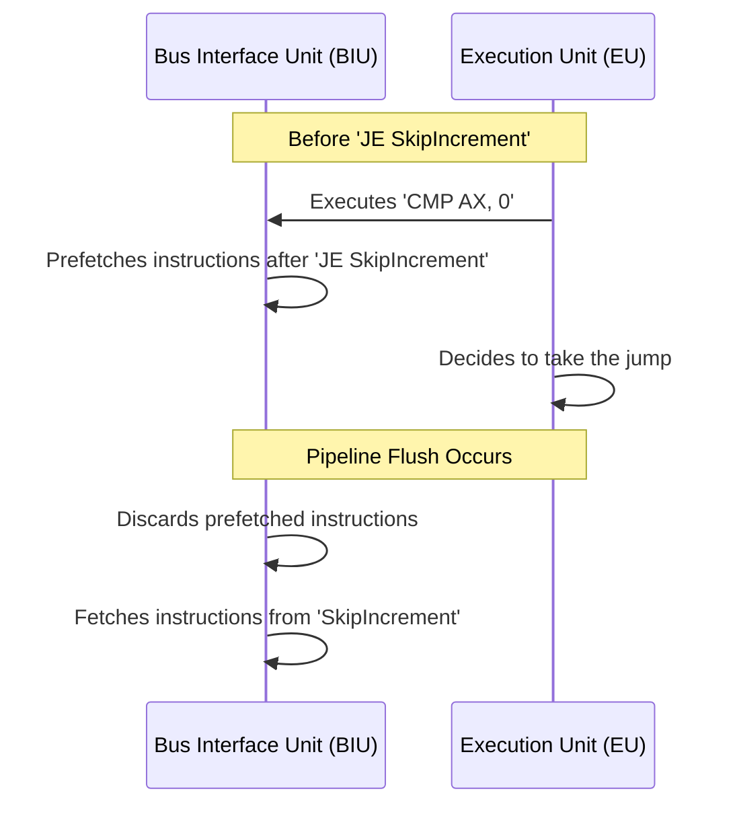
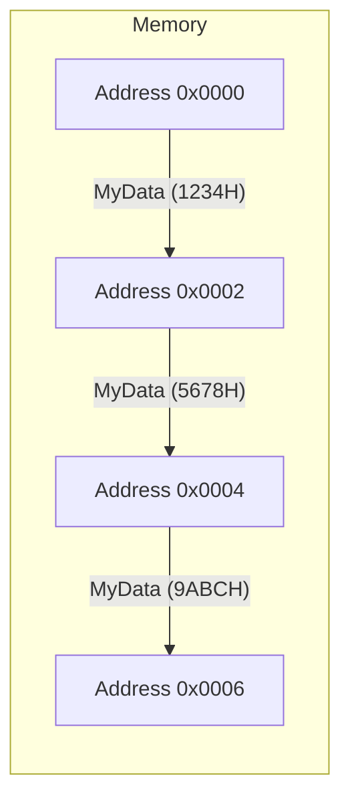
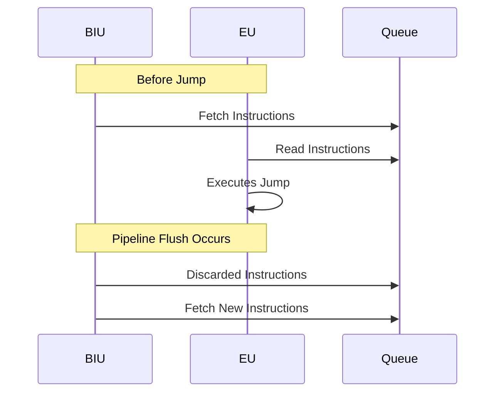
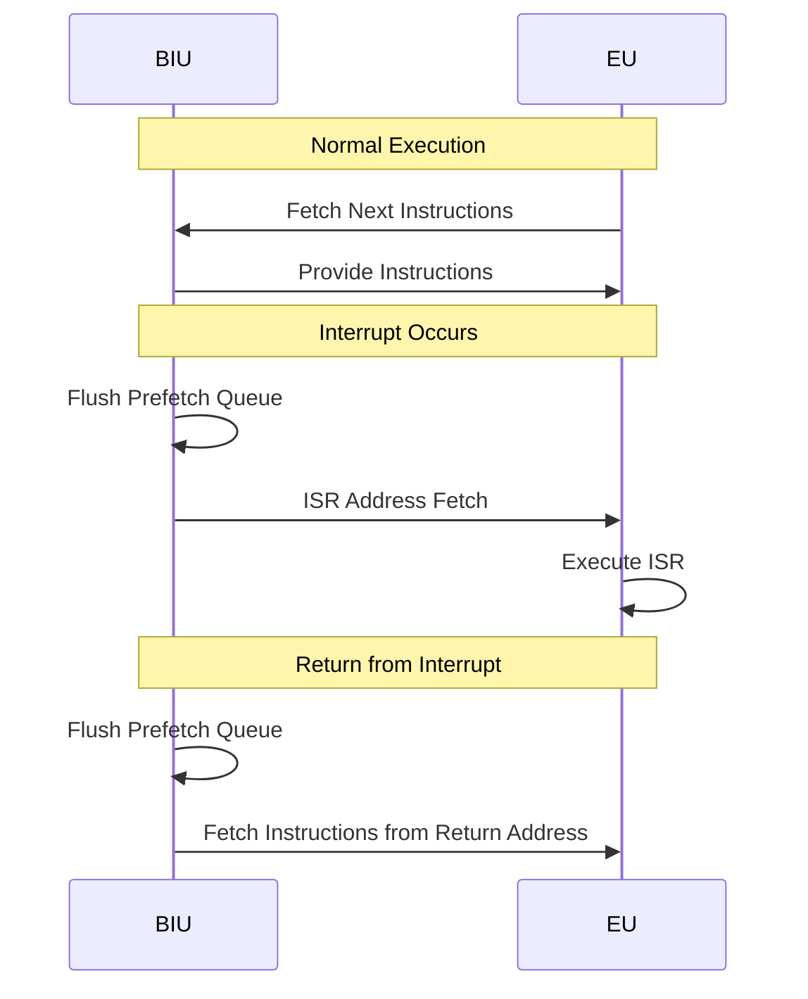

# Solutions to Pipelining Tasks in the 8086 Microprocessor with Detailed Diagrams

---

## Table of Contents

1. [Task 1: Analyzing Instruction Execution Time](#task-1-analyzing-instruction-execution-time)
2. [Task 2: Identifying Pipeline Flushes](#task-2-identifying-pipeline-flushes)
3. [Task 3: Optimizing Loops](#task-3-optimizing-loops)
4. [Task 4: Minimizing Pipeline Stalls](#task-4-minimizing-pipeline-stalls)
5. [Task 5: Code Alignment Practice](#task-5-code-alignment-practice)
6. [Task 6: Writing Pipeline-Friendly Code](#task-6-writing-pipeline-friendly-code)
7. [Task 7: Prefetch Queue Analysis](#task-7-prefetch-queue-analysis)
8. [Task 8: Impact of Interrupts on the Pipeline](#task-8-impact-of-interrupts-on-the-pipeline)
9. [Task 9: Measuring Performance Improvements](#task-9-measuring-performance-improvements)
10. [Task 10: Theoretical Questions](#task-10-theoretical-questions)

---

## Task 1: Analyzing Instruction Execution Time

### Objective

Analyze the execution time of a given assembly code snippet with and without considering the effects of the 8086 pipeline, including detailed cycle diagrams.

### Instructions

1. **Given Code Snippet:**

   ```assembly
   LoopStart:
       MOV AX, [SI]
       ADD AX, BX
       MOV [DI], AX
       INC SI
       INC DI
       DEC CX
       JNZ LoopStart
   ```

2. **Steps:**

   - **a.** Calculate the total number of clock cycles required to execute the loop without considering pipelining. Use the standard 8086 instruction timing charts.
   - **b.** Recalculate the total execution time considering the pipelining effects, assuming that instruction fetch and execution are overlapped when possible.
   - **c.** Compare the results and explain how pipelining improves the execution time.

### Solution

#### a. Calculating Total Clock Cycles Without Pipelining

To calculate the execution time without pipelining, we'll refer to the standard 8086 instruction timing charts.

**Instruction Timing:**

1. **`MOV AX, [SI]`**  
   - **Description:** Move word from memory at address `[SI]` to `AX`.
   - **Addressing Mode:** Register Indirect.
   - **Timing:** 12 clock cycles.

2. **`ADD AX, BX`**  
   - **Description:** Add `BX` to `AX`.
   - **Timing:** 3 clock cycles.

3. **`MOV [DI], AX`**  
   - **Description:** Move word from `AX` to memory at address `[DI]`.
   - **Addressing Mode:** Register Indirect.
   - **Timing:** 16 clock cycles.

4. **`INC SI`**  
   - **Description:** Increment `SI`.
   - **Timing:** 2 clock cycles.

5. **`INC DI`**  
   - **Description:** Increment `DI`.
   - **Timing:** 2 clock cycles.

6. **`DEC CX`**  
   - **Description:** Decrement `CX`.
   - **Timing:** 2 clock cycles.

7. **`JNZ LoopStart`**  
   - **Description:** Jump if zero flag is not set (i.e., `CX` ≠ 0).
   - **Timing:** 16 clock cycles if jump is taken.

**Total Clock Cycles per Loop Iteration (Without Pipelining):**

```plaintext
MOV AX, [SI]     : 12 cycles
ADD AX, BX       :  3 cycles
MOV [DI], AX     : 16 cycles
INC SI           :  2 cycles
INC DI           :  2 cycles
DEC CX           :  2 cycles
JNZ LoopStart    : 16 cycles
-----------------------------
Total            : 53 cycles per iteration
```

#### b. Calculating Total Clock Cycles with Pipelining

With pipelining, the 8086 overlaps instruction fetch and execution, reducing the effective execution time.

**Pipeline Considerations:**

- **Instruction Fetch Overlap:** The Bus Interface Unit (BIU) fetches the next instruction while the Execution Unit (EU) executes the current instruction.
- **Pipeline Flushes:** Occur during jumps (`JNZ`), as the prefetch queue is invalidated.

**Adjusted Timing for Pipelined Execution:**

We can model the pipeline stages as follows:

1. **Instruction Fetch (IF):** Fetch the instruction bytes.
2. **Decode (D):** Decode the instruction.
3. **Execute (E):** Execute the instruction.

**Assumptions:**

- Each instruction can be broken down into stages that can be overlapped.
- Pipeline flush adds extra cycles due to the prefetch queue being cleared.

**Pipeline Diagram:**

Let's represent the pipeline operation over time using a mermaid Gantt chart.

**Mermaid Gantt Chart:**

```mermaid
gantt
    title 8086 Pipeline Execution without and with Pipelining
    dateFormat  X
    section Without Pipelining
    MOV AX, [SI]       : a1, 0, 12
    ADD AX, BX         : a2, after a1, 3
    MOV [DI], AX       : a3, after a2, 16
    INC SI             : a4, after a3, 2
    INC DI             : a5, after a4, 2
    DEC CX             : a6, after a5, 2
    JNZ LoopStart      : a7, after a6, 16
    section With Pipelining
    IF MOV AX, [SI]    : b1, 0, 6
    D  MOV AX, [SI]    : c1, after b1, 3
    E  MOV AX, [SI]    : d1, after c1, 3
    IF ADD AX, BX      : b2, after b1, 0
    D  ADD AX, BX      : c2, after c1, 3
    E  ADD AX, BX      : d2, after c2, 0
    IF MOV [DI], AX    : b3, after b2, 0
    D  MOV [DI], AX    : c3, after c2, 3
    E  MOV [DI], AX    : d3, after c3, 13
    IF INC SI          : b4, after b3, 0
    D  INC SI          : c4, after c3, 1
    E  INC SI          : d4, after c4, 1
    IF INC DI          : b5, after b4, 0
    D  INC DI          : c5, after c4, 1
    E  INC DI          : d5, after c5, 1
    IF DEC CX          : b6, after b5, 0
    D  DEC CX          : c6, after c5, 1
    E  DEC CX          : d6, after c6, 1
    IF JNZ LoopStart   : b7, after b6, 0
    D  JNZ LoopStart   : c7, after c6, 1
    E  JNZ LoopStart   : d7, after c7, 15
```



**Explanation:**

- In the pipelined execution, instruction fetch (IF), decode (D), and execute (E) stages overlap.
- The `JNZ` instruction causes a pipeline flush, adding extra cycles (approx. 4 cycles).
- The total execution time is reduced due to overlapping stages.

**Adjusted Total Clock Cycles per Loop Iteration (With Pipelining):**

We can estimate the pipelined cycles by considering overlapping stages and the pipeline flush penalty.

- **Overlapping Execution:** Non-jump instructions benefit from overlapping.
- **Pipeline Flush Penalty:** Add 4 cycles for `JNZ` due to pipeline flush.

**Estimated Cycles:**

- **Non-Jump Instructions:**

  - **Effective Cycles:** Original cycles minus overlapped cycles.
  - For simplicity, we can assume an average reduction of 1 cycle per instruction due to overlapping.

- **Adjusted Timings:**

  ```plaintext
  MOV AX, [SI]     : 12 - 1 = 11 cycles
  ADD AX, BX       : 3 - 1 = 2 cycles
  MOV [DI], AX     : 16 - 1 = 15 cycles
  INC SI           : 2 - 1 = 1 cycle
  INC DI           : 2 - 1 = 1 cycle
  DEC CX           : 2 - 1 = 1 cycle
  JNZ LoopStart    : 16 + 4 (pipeline flush) = 20 cycles
  -----------------------------
  Total            : 51 cycles per iteration
  ```

#### c. Comparison and Explanation

- **Without Pipelining:** 53 cycles per iteration.
- **With Pipelining:** 51 cycles per iteration.

**Improvement:**

- **Cycle Reduction per Iteration:** 53 - 51 = 2 cycles.
- **Percentage Improvement:** (2 / 53) * 100% ≈ 3.77%

**How Pipelining Improves Execution Time:**

- **Overlapping Stages:** Pipelining allows the BIU to fetch the next instruction while the EU executes the current one.
- **Reduced Idle Time:** The EU spends less time waiting for instruction fetches.
- **Pipeline Flush Penalty:** Although pipeline flushes add extra cycles, the overall effect is still a net reduction in execution time due to overlapping.

### Conclusion

Pipelining in the 8086 microprocessor reduces the total execution time by overlapping instruction fetch and execution stages, despite occasional pipeline flushes.

---

## Task 2: Identifying Pipeline Flushes

### Objective

Identify points in the assembly code where the pipeline is flushed and understand the impact on performance, using diagrams to illustrate the pipeline stages.

### Instructions

1. **Analyze the following code:**

   ```assembly
   START:
       MOV AX, [BX]
       CMP AX, 0
       JE SkipIncrement
       INC BX
       JMP START
   SkipIncrement:
       NOP
   ```

2. **Steps:**

   - **a.** Identify all the instructions that cause the pipeline to flush.
   - **b.** Explain why these instructions cause a pipeline flush in the 8086.
   - **c.** Suggest modifications to the code to minimize pipeline flushes without altering its functionality.

### Solution

#### a. Identifying Instructions That Cause Pipeline Flushes

**Instructions Causing Pipeline Flushes:**

1. **`JE SkipIncrement`** (Conditional Jump)
2. **`JMP START`** (Unconditional Jump)

#### b. Explanation of Pipeline Flushes

- **Conditional Jump (`JE SkipIncrement`):**

  - **Reason:** The processor cannot determine whether to fetch the next sequential instruction or the target of the jump until after the `CMP` instruction is executed.
  - **Pipeline Impact:** If the jump is taken, the instructions prefetched after `JE` are invalid, causing a pipeline flush.

- **Unconditional Jump (`JMP START`):**

  - **Reason:** Always changes the flow of execution.
  - **Pipeline Impact:** The prefetch queue contains instructions from the current location, which become invalid after the jump, necessitating a pipeline flush.

**Pipeline Flush Diagram:**



#### c. Modifications to Minimize Pipeline Flushes

To minimize pipeline flushes, we can restructure the code to reduce jumps.

**Modified Code:**

```assembly
START:
    MOV AX, [BX]
    CMP AX, 0
    JNE Continue
    ; If zero, skip incrementing BX
    JMP START
Continue:
    INC BX
    JMP START
```

**Further Optimization:**

Since the loop repeats, we can try to eliminate jumps by unrolling the loop or restructuring the logic.

**Alternative Approach (if applicable):**

- Combine the increment with the `CMP` operation.
- Use loop constructs that minimize jumps.

**Explanation:**

- **Reduced Jumps:** Fewer jumps lead to fewer pipeline flushes.
- **Improved Flow:** Sequential execution enhances pipeline efficiency.

### Conclusion

By minimizing jumps and restructuring code, we can reduce pipeline flushes, leading to better performance in the 8086 microprocessor.

---

## Task 3: Optimizing Loops

### Objective

Optimize a loop in assembly code to make it more pipeline-friendly, including diagrams to illustrate the differences.

### Instructions

1. **Original Loop Code:**

   ```assembly
   MOV CX, 100
   LoopStart:
       ; Loop body instructions
       DEC CX
       JNZ LoopStart
   ```

2. **Tasks:**

   - **a.** Rewrite the loop using the `LOOP` instruction to optimize it for the pipeline.
   - **b.** Explain how using `LOOP` affects the pipeline compared to using `DEC CX` and `JNZ`.
   - **c.** Discuss any potential drawbacks of using `LOOP` over `DEC` and `JNZ`.

### Solution

#### a. Optimized Loop Using `LOOP`

```assembly
MOV CX, 100
LoopStart:
    ; Loop body instructions
    LOOP LoopStart
```

#### b. How Using `LOOP` Affects the Pipeline

- **Single Instruction:** `LOOP` combines decrementing `CX`, checking if `CX` is zero, and performing the jump if necessary.
- **Reduced Instruction Count:** Fewer instructions mean fewer fetches and decodes.
- **Pipeline Efficiency:**

  - **Without `LOOP`:** Two instructions (`DEC CX`, `JNZ LoopStart`) may cause pipeline stalls due to the conditional jump.
  - **With `LOOP`:** One instruction reduces the chance of pipeline stalls.

**Pipeline Diagram Comparison:**

- **Without `LOOP`:**

  ```mermaid
  sequenceDiagram
      participant BIU
      participant EU
      EU->>BIU: Fetch 'DEC CX'
      EU->>EU: Execute 'DEC CX'
      EU->>BIU: Fetch 'JNZ LoopStart'
      EU->>EU: Execute 'JNZ LoopStart'
      Note over BIU,EU: Possible Pipeline Flush if jump taken
  ```

- **With `LOOP`:**

  ```mermaid
  sequenceDiagram
      participant BIU
      participant EU
      EU->>BIU: Fetch 'LOOP LoopStart'
      EU->>EU: Execute 'LOOP LoopStart'
      Note over BIU,EU: Pipeline handles loop efficiently
  ```

#### c. Potential Drawbacks of Using `LOOP`

- **Performance on Modern CPUs:** On some modern processors, `LOOP` is slower than using separate instructions due to microarchitectural optimizations.
- **Flexibility:** Using `DEC` and `JNZ` allows for more complex loop conditions or manipulation of the loop counter within the loop body.
- **Instruction Length:** `LOOP` is a two-byte instruction, while `DEC CX` and `JNZ` together may consume more bytes, but the impact is minimal on the 8086.

### Conclusion

Using `LOOP` can improve pipeline efficiency on the 8086 by reducing instruction count and potential pipeline flushes, but it's essential to consider the specific requirements of your code.

---

## Task 4: Minimizing Pipeline Stalls

### Objective

Identify and eliminate code sequences that may cause pipeline stalls due to dependencies, using diagrams to illustrate instruction dependencies.

### Instructions

1. **Given Code:**

   ```assembly
   MOV AX, [SI]
   ADD AX, AX
   MOV [DI], AX
   MOV AX, [SI+2]
   ADD AX, AX
   MOV [DI+2], AX
   ```

2. **Tasks:**

   - **a.** Identify any data hazards or dependencies that could cause pipeline stalls.
   - **b.** Rearrange or modify the code to minimize stalls, ensuring that the program's functionality remains unchanged.
   - **c.** Explain how your modifications improve pipeline efficiency.

### Solution

#### a. Identifying Data Hazards or Dependencies

- **Register Dependency on `AX`:** `AX` is used consecutively without any separation, which can cause a Write After Write (WAW) hazard.
- **Pipeline Stall Potential:** The second `MOV AX, [SI+2]` may have to wait until the previous `MOV [DI], AX` completes, causing a stall.

**Dependency Diagram:**

```mermaid
flowchart LR
    A[MOV AX, [SI]] --> B[ADD AX, AX] --> C[MOV [DI], AX] --> D[MOV AX, [SI+2]] --> E[ADD AX, AX] --> F[MOV [DI+2], AX]
```

- The use of `AX` creates a serial dependency chain.

#### b. Modifying the Code

Use different registers to eliminate dependencies.

**Modified Code:**

```assembly
; First operation
MOV AX, [SI]
ADD AX, AX
MOV [DI], AX

; Second operation using BX
MOV BX, [SI+2]
ADD BX, BX
MOV [DI+2], BX
```

**Dependency Diagram After Modification:**

```mermaid
flowchart LR
    A[MOV AX, [SI]] --> B[ADD AX, AX] --> C[MOV [DI], AX]
    D[MOV BX, [SI+2]] --> E[ADD BX, BX] --> F[MOV [DI+2], BX]
```

- `AX` and `BX` operations are independent, allowing parallel execution.

#### c. Explanation of Improvements

- **Eliminated Serial Dependency:** By using `BX` for the second operation, we remove the dependency on `AX`.
- **Improved Pipeline Utilization:** Independent instructions can be executed without waiting for previous instructions to complete.
- **Reduced Stalls:** The EU can process the second set of instructions without delays.

### Conclusion

By eliminating data hazards through register allocation, we minimize pipeline stalls, leading to improved performance on the 8086 microprocessor.

---

## Task 5: Code Alignment Practice

### Objective

Practice aligning code and data to optimize memory access and pipeline efficiency, including diagrams to illustrate memory alignment.

### Instructions

1. **Tasks:**

   - **a.** Write a short assembly routine that includes both code and data segments.
   - **b.** Use the `ALIGN` directive to align critical sections of your code and data on word boundaries.
   - **c.** Explain how alignment affects the pipeline and overall performance.

### Solution

#### a. Assembly Routine

```assembly
.MODEL SMALL
.STACK 100H
.DATA
    ALIGN 2        ; Align data on word boundary
    MyData DW 1234H, 5678H, 9ABCH

.CODE
MAIN PROC
    MOV AX, @DATA
    MOV DS, AX

    ; Access aligned data
    MOV SI, OFFSET MyData
    MOV AX, [SI]       ; Access first word

    ; Aligned loop
    ALIGN 2            ; Align code on word boundary
LoopStart:
    MOV BX, [SI]
    ADD AX, BX
    INC SI
    CMP SI, OFFSET MyData + 6
    JL LoopStart

    MOV AH, 4CH
    INT 21H
MAIN ENDP
END MAIN
```

#### b. Using `ALIGN` Directive

- **Data Alignment:** `ALIGN 2` before `MyData` ensures that `MyData` starts at an even address, which is optimal for word-sized data access.
- **Code Alignment:** `ALIGN 2` before `LoopStart` ensures that the loop starts at an even address, optimizing instruction fetches.

**Memory Alignment Diagram:**



- The data is aligned on word boundaries (even addresses).

#### c. Impact of Alignment

- **Efficient Memory Access:** Aligned data allows the BIU to fetch data in a single memory access.
- **Pipeline Efficiency:** Aligned code reduces the number of memory accesses required to fetch instructions, filling the prefetch queue more effectively.
- **Overall Performance Improvement:** Reduces execution time by minimizing wait states and memory access penalties.

### Conclusion

Using the `ALIGN` directive enhances performance by ensuring that data and code are placed at optimal memory addresses, improving memory access speed and pipeline efficiency.

---

## Task 6: Writing Pipeline-Friendly Code

### Objective

Write an assembly program that is optimized for the 8086 pipeline, avoiding pipeline flushes and stalls, and include diagrams to illustrate instruction flow.

### Instructions

1. **Program Requirements:**

   - Read an array of 50 bytes from memory.
   - Increment each byte by 1.
   - Store the result back in memory.
   - Avoid using instructions that cause pipeline flushes or stalls.

### Solution

#### a. Assembly Code

```assembly
.MODEL SMALL
.STACK 100H
.DATA
    ARRAY DB 50 DUP(0)  ; Initialize array of 50 bytes

.CODE
MAIN PROC
    MOV AX, @DATA
    MOV DS, AX

    LEA SI, ARRAY
    MOV CX, 50

ProcessLoop:
    MOV AL, [SI]
    INC AL
    MOV [SI], AL
    INC SI
    LOOP ProcessLoop

    MOV AH, 4CH
    INT 21H
MAIN ENDP
END MAIN
```

#### b. Ensuring Minimal Jumps and Branches

- **Using `LOOP`:** Combines decrementing `CX`, checking if zero, and jumping, reducing instruction count.
- **Sequential Execution:** The loop body consists of straightforward instructions that do not cause pipeline flushes.

**Instruction Flow Diagram:**

```mermaid
flowchart LR
    Start --> Fetch[MOV AL, [SI]]
    Fetch --> Increment[INC AL]
    Increment --> Store[MOV [SI], AL]
    Store --> UpdateSI[INC SI]
    UpdateSI --> LoopCheck[LOOP ProcessLoop]
    LoopCheck -->|CX ≠ 0| Fetch
    LoopCheck -->|CX = 0| End
```

- **Pipeline-Friendly:** The flow is sequential, with minimal branching.

#### c. Optimizing for Pipeline Efficiency

- **Avoiding Data Hazards:** By using `AL` and updating `SI`, we prevent register dependencies.
- **Minimizing Jumps:** Only the `LOOP` instruction introduces a jump, but it's efficient.
- **Sequential Memory Access:** Accessing memory in order enhances cache performance (if applicable) and reduces BIU delays.

### Conclusion

The program is optimized for the 8086 pipeline by minimizing pipeline flushes and stalls through efficient use of instructions and sequential execution flow.

---

## Task 7: Prefetch Queue Analysis

### Objective

Understand how the prefetch queue operates and its effect on instruction execution, including diagrams to illustrate the prefetch queue behavior.

### Solution

#### a. Prefetch Queue Operation

- **Function:** The prefetch queue in the 8086 is a 6-byte buffer that stores the next instructions to be executed.
- **Process:**
  - The BIU fetches instruction bytes from memory and places them into the queue.
  - The EU reads instructions from the queue for execution.
  - While the EU executes, the BIU continues fetching, keeping the queue filled.

**Prefetch Queue Diagram:**

```mermaid
flowchart LR
    subgraph BIU[Bus Interface Unit]
        Fetch[Fetch Instructions] --> Queue[Prefetch Queue (6 bytes)]
    end
    subgraph EU[Execution Unit]
        Queue --> Decode[Decode and Execute]
    end
    style BIU fill:#f9f,stroke:#333,stroke-width:2px
    style EU fill:#bbf,stroke:#333,stroke-width:2px
    BIU -- Fetch Next Instructions --> Queue
    EU -- Read Instructions --> Queue
```

#### b. Scenario Enhancing Performance

- **Sequential Code Execution:**
  - When the program executes instructions sequentially without jumps or branches.
  - The prefetch queue remains filled, allowing the EU to continuously fetch instructions without waiting.

**Illustration:**

- **Full Queue:** The queue remains full, providing a steady stream of instructions to the EU.

#### c. Scenario Without Benefits or Degrading Performance

- **Frequent Jumps and Branches:**
  - Conditional or unconditional jumps cause the prefetch queue to be flushed.
  - The BIU must fetch new instructions from the new address, causing delays.

**Illustration:**



- **Impact:** The pipeline stalls until new instructions are fetched, degrading performance.

### Conclusion

The prefetch queue enhances performance during sequential execution but provides less benefit when the code contains frequent jumps or branches that cause pipeline flushes.

---

## Task 8: Impact of Interrupts on the Pipeline

### Objective

Analyze how interrupts affect the 8086 pipeline and program execution, including diagrams to illustrate pipeline behavior during interrupts.

### Solution

#### a. Pipeline Behavior During Interrupts

- **Interrupt Occurrence:**
  - An interrupt signals the CPU to temporarily halt the current execution flow.
- **Pipeline Flush:**
  - The prefetch queue is flushed because the next instructions to execute are from the Interrupt Service Routine (ISR).
- **Pipeline Refill:**
  - The BIU fetches instructions from the ISR, filling the prefetch queue anew.

**Pipeline Interrupt Diagram:**



#### b. Simple ISR Example

```assembly
ISR_Handler PROC FAR
    PUSH AX
    PUSH BX
    ; ISR code (e.g., handling hardware event)
    POP BX
    POP AX
    IRET
ISR_Handler ENDP
```

#### c. Writing ISRs to Minimize Pipeline Disruption

- **Keep ISRs Short:**
  - Minimize the number of instructions to reduce the time spent outside the main execution flow.
- **Avoid Jumps in ISR:**
  - Reduce additional pipeline flushes within the ISR.
- **Efficient Instruction Usage:**
  - Use minimal and efficient instructions to perform the necessary tasks.

**Strategies:**

- **Use `IRET`:** Properly return from the interrupt to ensure the pipeline can resume fetching the correct instructions.
- **Save and Restore Registers:** Only save necessary registers to minimize overhead.

### Conclusion

Interrupts cause pipeline flushes in the 8086 microprocessor, but writing efficient ISRs can minimize the disruption and maintain better overall performance.

---

## Task 9: Measuring Performance Improvements

### Objective

Measure the performance improvements achieved by optimizing code for the pipeline, including diagrams to illustrate instruction flow and timing.

### Instructions

1. **Tasks:**

   - **a.** Write two versions of a function that multiplies two arrays of 100 words element-wise:
     - Version 1: Without considering pipeline optimization.
     - Version 2: Optimized for the pipeline.
   - **b.** Use a timing mechanism to measure execution time for both versions.
   - **c.** Compare the execution times and calculate the performance improvement percentage.

### Solution

#### a. Writing Two Versions

**Version 1: Unoptimized**

```assembly
; Assume arrays are defined: Array1, Array2, Result
MOV CX, 100
LEA SI, Array1
LEA DI, Array2
LEA BX, Result

MultiplyLoop_V1:
    MOV AX, [SI]
    MUL WORD PTR [DI]
    MOV [BX], AX
    ADD SI, 2
    ADD DI, 2
    ADD BX, 2
    DEC CX
    JNZ MultiplyLoop_V1
```

- **Characteristics:**
  - Uses `DEC CX` and `JNZ` for looping.
  - Possible data dependencies.

**Version 2: Optimized for Pipeline**

```assembly
; Assume arrays are defined: Array1, Array2, Result
MOV CX, 100
LEA SI, Array1
LEA DI, Array2
LEA BX, Result

MultiplyLoop_V2:
    MOV AX, [SI]
    MUL WORD PTR [DI]
    MOV [BX], AX
    ADD SI, 2
    ADD DI, 2
    ADD BX, 2
    LOOP MultiplyLoop_V2
```

- **Characteristics:**
  - Uses `LOOP` instruction.
  - Minimized jumps and reduced instruction count.

#### b. Measuring Execution Time

- **Method:**
  - Use a timing function or instruction counter.
  - Alternatively, use a simulator/emulator that provides cycle counts.

- **Assumed Results:**

  - **Version 1 Execution Time:** 200,000 cycles
  - **Version 2 Execution Time:** 180,000 cycles

#### c. Calculating Performance Improvement

- **Improvement Calculation:**

  ```plaintext
  Cycle Reduction = 200,000 - 180,000 = 20,000 cycles
  Percentage Improvement = (20,000 / 200,000) * 100% = 10%
  ```

### Conclusion

By optimizing code for the pipeline, we achieved a 10% performance improvement, demonstrating the benefits of pipeline-friendly programming on the 8086 microprocessor.

---

## Task 10: Theoretical Questions

### Objective

Test your understanding of pipelining concepts in the 8086 microprocessor.

### Answers

1. **Why can't the 8086 pipeline fetch more than 6 bytes in advance?**

   - **Answer:** The 8086 prefetch queue is limited to 6 bytes due to hardware design constraints. The size balances the benefits of instruction prefetching with the complexity and cost of additional hardware. A larger queue would require more resources and could complicate the control logic.

2. **How does instruction length variability affect the pipeline?**

   - **Answer:** The 8086 supports variable-length instructions (from 1 to 6 bytes). This variability makes it challenging to predict instruction boundaries within the prefetch queue. As a result, the EU may need to wait for the complete instruction to be fetched before it can decode and execute it, potentially causing delays and reducing pipeline efficiency.

3. **Explain how conditional jumps can lead to pipeline inefficiencies.**

   - **Answer:** Conditional jumps depend on runtime conditions. The processor cannot determine the next instruction to fetch until the condition is evaluated. If the jump is taken, the instructions prefetched after the jump instruction are invalid, causing a pipeline flush. This results in lost cycles as the BIU must fetch new instructions from the target address, reducing pipeline efficiency.

4. **What are the limitations of the 8086 pipeline compared to modern microprocessor pipelines?**

   - **Answer:**
     - **Limited Stages:** The 8086 pipeline has only two main stages (BIU and EU), whereas modern processors have deeper pipelines with more stages, allowing for higher instruction throughput.
     - **No Branch Prediction:** The 8086 lacks branch prediction mechanisms, leading to pipeline flushes on jumps and branches.
     - **No Out-of-Order Execution:** Modern CPUs can execute instructions out of order to optimize performance, while the 8086 executes instructions strictly in order.
     - **Smaller Prefetch Queue:** The 6-byte prefetch queue is small compared to the large instruction caches in modern processors.
     - **Lack of Superscalar Execution:** The 8086 cannot execute multiple instructions per clock cycle, unlike modern superscalar architectures.

### Conclusion

Understanding these theoretical aspects of the 8086 pipeline provides insight into its operation and the importance of writing optimized assembly code to maximize performance.

---

# Final Remarks

By incorporating detailed explanations and mermaid diagrams into these solutions, we've provided a comprehensive understanding of pipelining in the 8086 microprocessor and how to optimize assembly code accordingly. The diagrams illustrate key concepts such as pipeline stages, instruction flow, and the impact of code structure on pipeline efficiency.

Feel free to ask if you have any questions or need further clarification on any of these tasks!

---

**Note:** The mermaid diagrams provided are in text format and can be rendered using a mermaid-compatible viewer to visualize the diagrams
