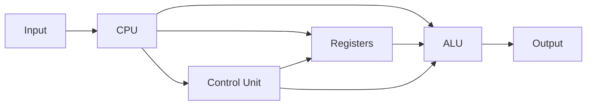
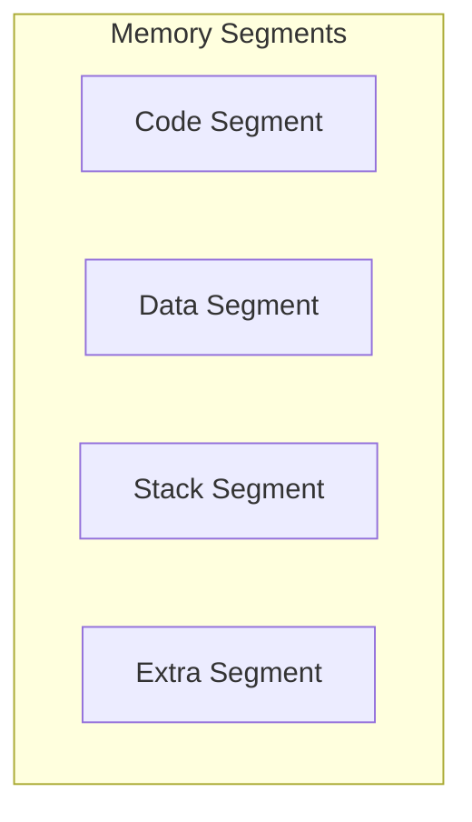
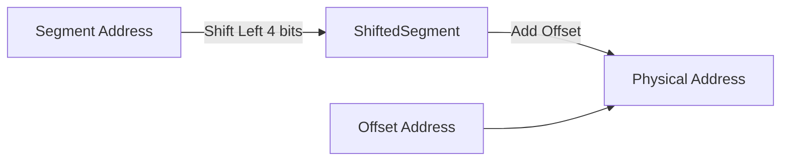
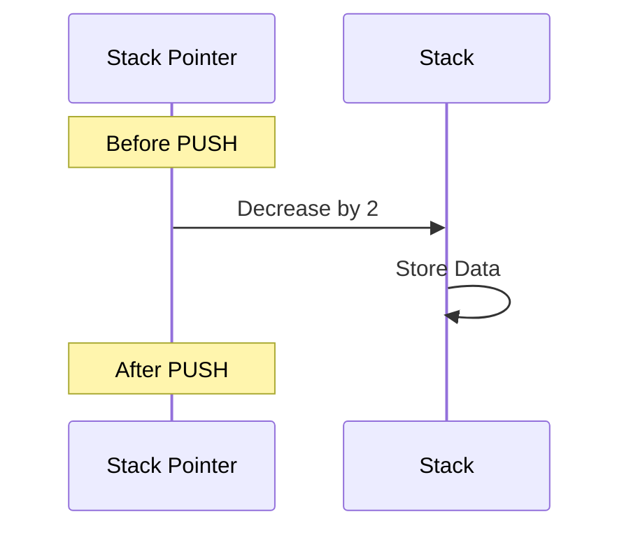
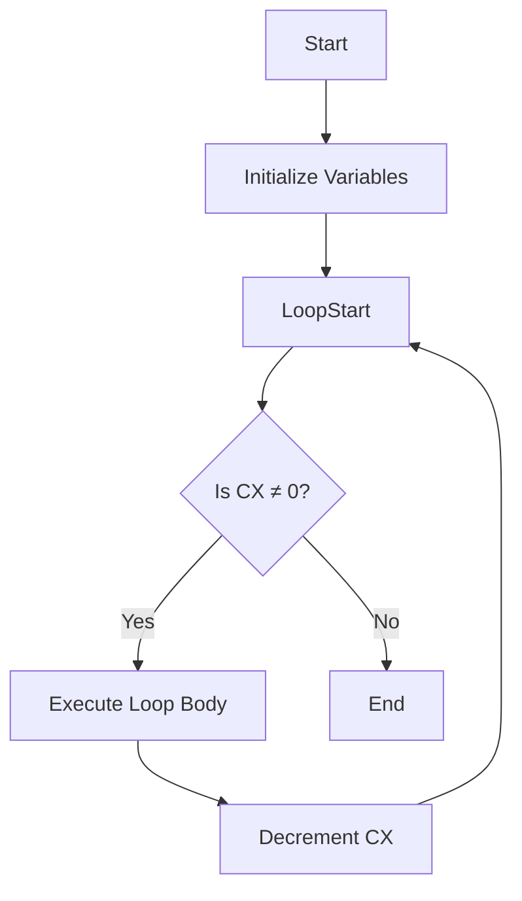
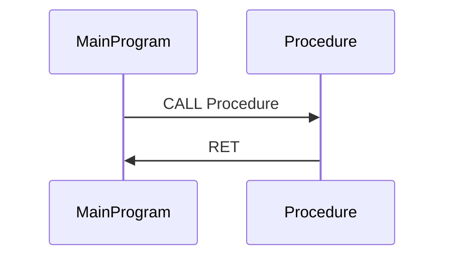
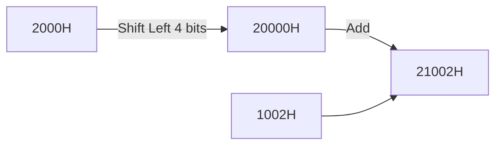
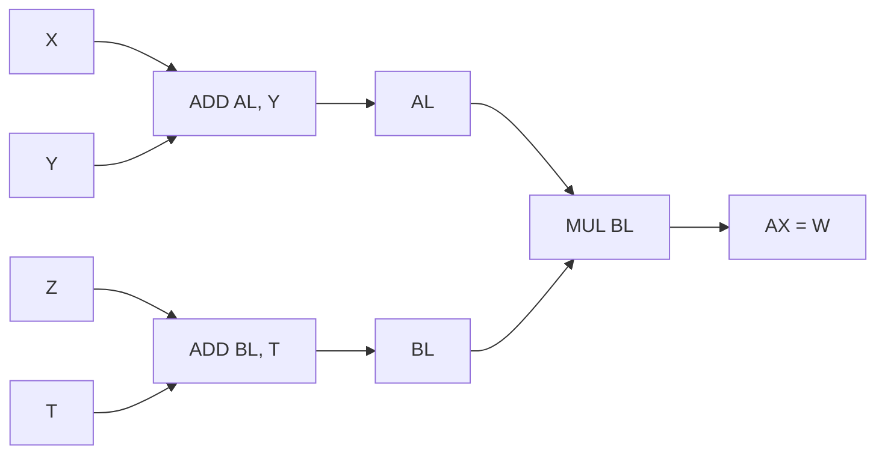
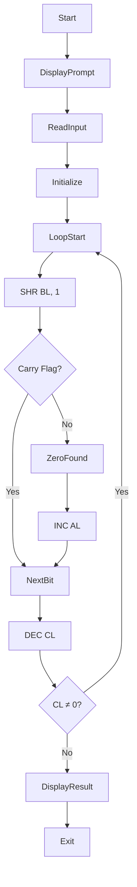

# 8086 Assembly Language Programming: A Comprehensive Lab Guide

## Table of Contents

1. [Introduction](#1-introduction)
2. [8086 Microprocessor Architecture](#2-8086-microprocessor-architecture)
   - [CPU Overview](#cpu-overview)
   - [Registers](#registers)
   - [Memory Segmentation](#memory-segmentation)
3. [Memory Addressing](#3-memory-addressing)
   - [Logical vs Physical Addresses](#logical-vs-physical-addresses)
   - [Physical Address Calculation](#physical-address-calculation)
   - [Examples with Diagrams](#examples-with-diagrams)
4. [Assembly Language Basics](#4-assembly-language-basics)
   - [Syntax and Structure](#syntax-and-structure)
   - [Assembler Directives](#assembler-directives)
   - [Instruction Format](#instruction-format)
5. [Data Movement Instructions](#5-data-movement-instructions)
   - [MOV Instruction](#mov-instruction)
   - [PUSH and POP Instructions](#push-and-pop-instructions)
6. [Arithmetic and Logic Instructions](#6-arithmetic-and-logic-instructions)
   - [Arithmetic Instructions](#arithmetic-instructions)
   - [Logic Instructions](#logic-instructions)
   - [Bit Manipulation Techniques](#bit-manipulation-techniques)
7. [Control Flow Instructions](#7-control-flow-instructions)
   - [Unconditional Jumps](#unconditional-jumps)
   - [Conditional Jumps](#conditional-jumps)
   - [Loops](#loops)
8. [Procedures and Stack Operations](#8-procedures-and-stack-operations)
   - [CALL and RET Instructions](#call-and-ret-instructions)
   - [Stack Manipulation](#stack-manipulation)
9. [String Instructions](#9-string-instructions)
   - [Overview of String Instructions](#overview-of-string-instructions)
10. [Interfacing with DOS Interrupts](#10-interfacing-with-dos-interrupts)
    - [INT 21h Services](#int-21h-services)
11. [Sample Programs and Exercises](#11-sample-programs-and-exercises)
    - [Memory Address Calculations](#memory-address-calculations)
    - [Bit Manipulation Exercises](#bit-manipulation-exercises)
    - [Stack Operations](#stack-operations)
    - [String Manipulation Exercises](#string-manipulation-exercises)
    - [Logical and Arithmetic Operations](#logical-and-arithmetic-operations)
    - [Keyboard and Display Interactions](#keyboard-and-display-interactions)
12. [Conclusion](#12-conclusion)

---

## 1. Introduction

This comprehensive guide is designed to help you understand and master assembly language programming on the 8086 microprocessor. It covers essential topics, provides detailed explanations, and includes examples and exercises to reinforce learning. Mermaid diagrams are used throughout to visualize concepts, especially memory addressing and CPU operations.

---

## 2. 8086 Microprocessor Architecture

### CPU Overview

The **Intel 8086** is a 16-bit microprocessor introduced by Intel in 1978. It forms the basis of the x86 architecture and has the following key features:

- **16-bit ALU (Arithmetic Logic Unit)**
- **20-bit Address Bus**: Allows access to 1 MB of memory.
- **Segmented Memory Architecture**: Divides memory into segments for efficient data management.

#### CPU Block Diagram



### Registers

Registers are small, fast storage locations within the CPU used for various operations.

#### General Purpose Registers

| Register | Purpose                  | High Byte | Low Byte |
|----------|--------------------------|-----------|----------|
| **AX**   | Accumulator              | AH        | AL       |
| **BX**   | Base Register            | BH        | BL       |
| **CX**   | Count Register           | CH        | CL       |
| **DX**   | Data Register            | DH        | DL       |

#### Segment Registers

| Register | Purpose          |
|----------|------------------|
| **CS**   | Code Segment     |
| **DS**   | Data Segment     |
| **SS**   | Stack Segment    |
| **ES**   | Extra Segment    |

#### Pointer and Index Registers

| Register | Purpose            |
|----------|--------------------|
| **SP**   | Stack Pointer      |
| **BP**   | Base Pointer       |
| **SI**   | Source Index       |
| **DI**   | Destination Index  |

### Memory Segmentation

Memory segmentation divides the memory into different segments for code, data, stack, and extra information.

#### Memory Segmentation Diagram



- **Segment Registers** hold the base addresses of the segments.
- **Offset Registers** (like IP, SI, DI) hold the offset within the segment.

---

## 3. Memory Addressing

Understanding memory addressing is crucial in assembly language programming.

### Logical vs Physical Addresses

- **Logical Address**: Consists of a segment and an offset (e.g., CS:IP).
- **Physical Address**: The actual address in memory.

#### Address Translation Diagram



### Physical Address Calculation

The physical address is calculated using:

\[
\text{Physical Address} = (\text{Segment} \times 16) + \text{Offset}
\]

or shifting the segment left by 4 bits (multiplying by 16) and adding the offset.

### Examples with Diagrams

**Example 1:**

- **CS = 1000H**, **IP = 0200H**

**Calculation:**

\[
\begin{align*}
\text{Segment} &= 1000H \\
\text{Offset} &= 0200H \\
\text{Physical Address} &= (1000H \times 10H) + 0200H = 10000H + 0200H = 10200H
\end{align*}
\]

**Memory Address Diagram:**


---

## 4. Assembly Language Basics

### Syntax and Structure

An assembly language program consists of:

- **Labels**: Markers for instructions.
- **Instructions**: Commands to the CPU.
- **Directives**: Instructions to the assembler.
- **Comments**: Notes for the programmer.

**Basic Structure:**

```assembly
[Label:]   Instruction   [Operands]   [; Comment]
```

### Assembler Directives

- **`ORG`**: Set the origin (starting address).
- **`END`**: End of the source code.
- **`DB`**: Define Byte.
- **`DW`**: Define Word.
- **`EQU`**: Equate a name to a value.

### Instruction Format

- **Opcode**: The operation to perform.
- **Operands**: Data to operate on.

**Example:**

```assembly
MOV AX, BX   ; Move the contents of BX into AX
```

---

## 5. Data Movement Instructions

### MOV Instruction

Transfers data between registers, memory, and immediate values.

**Syntax:**

```assembly
MOV Destination, Source
```

**Rules:**

- Cannot move from memory to memory directly.
- Cannot move immediate data to segment registers directly.

### PUSH and POP Instructions

- **PUSH Source**: Places data onto the stack.
- **POP Destination**: Retrieves data from the stack.

**Stack Operation Diagram:**



---

## 6. Arithmetic and Logic Instructions

### Arithmetic Instructions

- **ADD**: Addition.
- **SUB**: Subtraction.
- **MUL**: Multiplication.
- **DIV**: Division.

**Example:**

```assembly
ADD AX, BX   ; AX = AX + BX
```

### Logic Instructions

- **AND**: Bitwise AND.
- **OR**: Bitwise OR.
- **XOR**: Bitwise XOR.
- **NOT**: Bitwise NOT.

### Bit Manipulation Techniques

Manipulating individual bits using masks.

- **Clearing Bits**: Use AND with 0s.
- **Setting Bits**: Use OR with 1s.
- **Toggling Bits**: Use XOR with 1s.

---

## 7. Control Flow Instructions

### Unconditional Jumps

- **JMP Label**: Jump to a specified label.

### Conditional Jumps

Based on flag conditions.

- **JE/JZ**: Jump if equal/zero.
- **JNE/JNZ**: Jump if not equal/not zero.
- **JG/JNLE**: Jump if greater.
- **JL/JNGE**: Jump if less.

### Loops

- **LOOP Label**: Decrement CX and jump if CX ≠ 0.

**Loop Flowchart:**



---

## 8. Procedures and Stack Operations

### CALL and RET Instructions

- **CALL Label**: Calls a procedure.
- **RET**: Returns from a procedure.

**Procedure Call Diagram:**



### Stack Manipulation

Used to pass parameters and store return addresses.

---

## 9. String Instructions

### Overview of String Instructions

- **MOVSB/MOVSW**: Move string byte/word.
- **CMPSB/CMPSW**: Compare string byte/word.
- **SCASB/SCASW**: Scan string byte/word.
- **LODSB/LODSW**: Load string byte/word.
- **STOSB/STOSW**: Store string byte/word.

**Using REP Prefix:**

- **REP**: Repeat operation CX times.

---

## 10. Interfacing with DOS Interrupts

### INT 21h Services

Used for input/output operations.

- **AH = 01h**: Read character from keyboard.
- **AH = 02h**: Display character.
- **AH = 09h**: Display string.
- **AH = 4Ch**: Terminate program.

---

## 11. Sample Programs and Exercises

### Memory Address Calculations

#### Exercise 1

**Problem:** Find the physical address for the following CS:IP combinations.

a) CS=1000H, IP=0200H  
b) CS=3456H, IP=032DH

**Solution:**

a)  
\[
\text{Physical Address} = (1000H \times 10H) + 0200H = 10000H + 0200H = \textbf{10200H}
\]

**Address Diagram:**


b)  
\[
\text{Physical Address} = (3456H \times 10H) + 032DH = 34560H + 032DH = \textbf{3488DH}
\]

#### Exercise 2

**Problem:** Determine the physical address for the following register combinations.

a) DS=2000H, SI=1002H  
b) SS=2300H, BP=3200H  
c) DS=A000H, BX=1000H  
d) SS=2900H, SP=3A00H

**Solution:**

a)  
\[
\text{Physical Address} = (2000H \times 10H) + 1002H = 20000H + 1002H = \textbf{21002H}
\]

**Address Diagram:**



### Bit Manipulation Exercises

#### Exercise 6

**Problem:** Clear the three leftmost bits of DH and store the result in BH.

**Solution:**

```assembly
MOV BH, DH      ; Copy DH to BH
AND BH, 1FH     ; 0001 1111b, clears leftmost 3 bits
```

**Explanation:**

- **1FH** in binary is **0001 1111**.
- **AND** operation clears bits where mask has 0s.

#### Bitwise Operation Diagram

```mermaid
flowchart LR
    DH[Original DH]
    Mask[1FH (0001 1111b)]
    DH --> ANDOperation[AND]
    Mask --> ANDOperation
    ANDOperation --> BH[Result in BH]
```

### Stack Operations

#### Exercise 15

**Problem:** Given SP=1236H, AX=24B6H, DI=85C2H, DX=5F93H, show the stack and registers after executing:

1. PUSH AX
2. PUSH DI
3. POP AX
4. POP DX

**Solution:**

**Initial Stack Pointer: SP=1236H**

1. **PUSH AX**

   - SP = SP - 2 = 1236H - 2 = 1234H
   - Memory[1234H] = 24B6H

2. **PUSH DI**

   - SP = SP - 2 = 1234H - 2 = 1232H
   - Memory[1232H] = 85C2H

**Stack Diagram After PUSH Operations:**

```mermaid
stackDiagram
    direction BT
    SP[1232H]:85C2H
    SP[1234H]:24B6H
    SP[1236H]: (Initial SP)
```

3. **POP AX**

   - AX = Memory[1232H] = 85C2H
   - SP = SP + 2 = 1232H + 2 = 1234H

4. **POP DX**

   - DX = Memory[1234H] = 24B6H
   - SP = SP + 2 = 1234H + 2 = 1236H

**Final Register Values:**

- **AX = 85C2H**
- **DX = 24B6H**
- **SP = 1236H**

### String Manipulation Exercises

#### Exercise 19

**Problem:** Copy 10 words from STR1 to STR2 and then 20 words from STR2 to STR3 without using string instructions.

**Solution:**

```assembly
; Copy 10 words from STR1 to STR2
MOV CX, 10
LEA SI, STR1
LEA DI, STR2

CopyLoop1:
MOV AX, [SI]
MOV [DI], AX
ADD SI, 2
ADD DI, 2
LOOP CopyLoop1

; Copy 20 words from STR2 to STR3
MOV CX, 20
LEA SI, STR2
LEA DI, STR3

CopyLoop2:
MOV AX, [SI]
MOV [DI], AX
ADD SI, 2
ADD DI, 2
LOOP CopyLoop2
```

**Data Movement Diagram:**

```mermaid
flowchart LR
    subgraph Copy STR1 to STR2
        SI[STR1] --> ReadAX[MOV AX, [SI]]
        ReadAX --> WriteDI[MOV [DI], AX]
        WriteDI --> DI[STR2]
        SI -->|Increment| SI
        DI -->|Increment| DI
    end
    subgraph Copy STR2 to STR3
        SI2[STR2] --> ReadAX2[MOV AX, [SI]]
        ReadAX2 --> WriteDI2[MOV [DI], AX]
        WriteDI2 --> DI2[STR3]
        SI2 -->|Increment| SI2
        DI2 -->|Increment| DI2
    end
```

---

### Logical and Arithmetic Operations

#### Exercise 23

**Problem:** Calculate W = (X + Y)(Z + T), where X, Y, Z, T are 8-bit variables.

**Solution:**

```assembly
; Assume X, Y, Z, T are defined in the data segment
MOV AL, X
ADD AL, Y       ; AL = X + Y
MOV BL, Z
ADD BL, T       ; BL = Z + T
MUL BL          ; AX = AL * BL
; Store the 16-bit result in W
MOV W, AX
```

**Multiplication Diagram:**



### Keyboard and Display Interactions

#### Exercise 24

**Problem:** Write a program to count the number of 0s in a binary number input from the keyboard.

**Solution:**

```assembly
.MODEL SMALL
.STACK 100H
.DATA
    Prompt DB 'Enter a one-digit number: $'
    MsgZero DB 0DH,0AH,'Number of zeros: $'
    Number DB ?
    ZeroCount DB ?

.CODE
MAIN PROC
    MOV AX, @DATA
    MOV DS, AX

    ; Display Prompt
    MOV AH, 09H
    LEA DX, Prompt
    INT 21H

    ; Read Input
    MOV AH, 01H
    INT 21H
    SUB AL, '0'
    MOV Number, AL

    ; Initialize
    MOV BL, Number
    MOV CL, 8
    MOV AL, 0

CountLoop:
    SHR BL, 1
    JNC ZeroFound
    JMP NextBit

ZeroFound:
    INC AL

NextBit:
    DEC CL
    JNZ CountLoop

    MOV ZeroCount, AL

    ; Display Result
    MOV AH, 09H
    LEA DX, MsgZero
    INT 21H

    ; Convert to ASCII and Display
    ADD AL, '0'
    MOV DL, AL
    MOV AH, 02H
    INT 21H

    ; Exit
    MOV AH, 4CH
    INT 21H
MAIN ENDP
END MAIN
```

**Program Flow Diagram:**



---

## 12. Conclusion

This guide has provided an in-depth look at assembly language programming on the 8086 microprocessor. By breaking down topics, providing detailed explanations, and including visual diagrams, it aims to make complex concepts more understandable.

### Key Takeaways

- **Memory Addressing**: Understanding logical and physical addresses is crucial.
- **Instruction Set**: Familiarity with data movement, arithmetic, logic, and control flow instructions.
- **Bit Manipulation**: Essential for low-level programming tasks.
- **Procedures and Stack**: Managing function calls and data storage.
- **String Operations**: Efficient data handling using string instructions.
- **Interrupts**: Interfacing with system resources using interrupts.

### Next Steps

- **Practice**: Work through the exercises and write your own programs.
- **Experiment**: Modify the sample programs to reinforce learning.
- **Explore**: Dive deeper into advanced topics like hardware interfacing and optimization.

---

**Note:** Always test your assembly programs thoroughly to ensure they work as expected, especially when dealing with low-level operations that can affect system stability.
