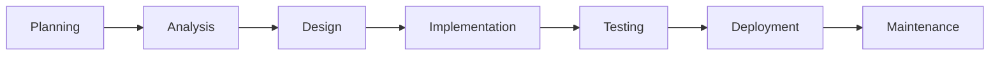
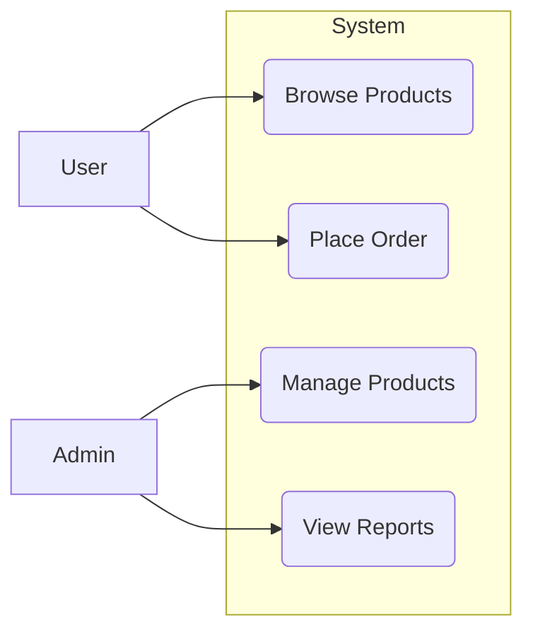
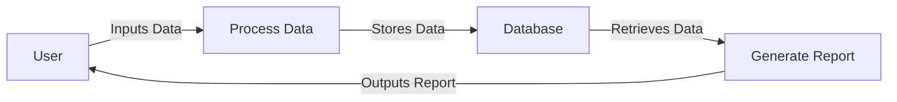
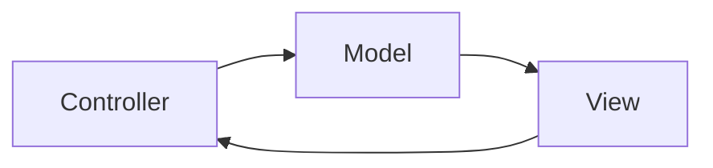
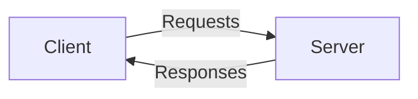
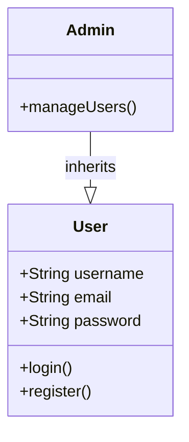
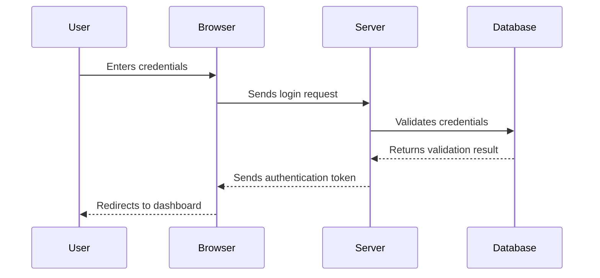
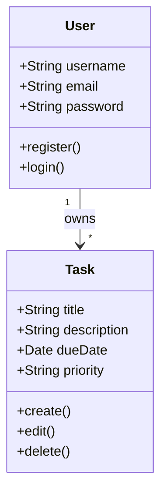
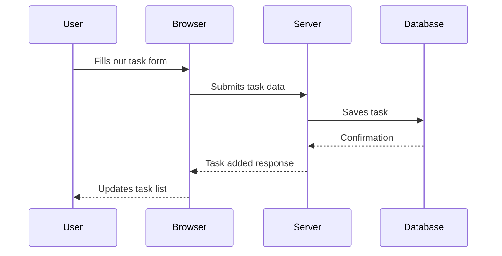

# Software Engineering Lab Manual

---

## Table of Contents

1. [Introduction to Practical Software Engineering](#1-introduction-to-practical-software-engineering)
   - [What is Software Engineering?](#what-is-software-engineering)
   - [Importance and Goals](#importance-and-goals)
   - [Software Development Life Cycle (SDLC)](#software-development-life-cycle-sdlc)
2. [Agile Approach](#2-agile-approach)
   - [Overview of Agile Methodology](#overview-of-agile-methodology)
   - [Agile Principles](#agile-principles)
   - [Comparison with Traditional Methods](#comparison-with-traditional-methods)
3. [Requirements and System Analysis](#3-requirements-and-system-analysis)
   - [Gathering Requirements](#gathering-requirements)
   - [System Analysis Techniques](#system-analysis-techniques)
   - [Use Case Diagrams](#use-case-diagrams)
4. [Managing Software Products](#4-managing-software-products)
   - [Epics](#epics)
   - [Features](#features)
   - [User Stories](#user-stories)
   - [Gherkin Language](#gherkin-language)
   - [Tasks](#tasks)
5. [Testing in Software Products](#5-testing-in-software-products)
   - [Importance of Testing](#importance-of-testing)
   - [Types of Testing](#types-of-testing)
   - [Test-Driven Development (TDD)](#test-driven-development-tdd)
6. [Feature High-Level Design](#6-feature-high-level-design)
   - [Designing Features](#designing-features)
   - [Architectural Considerations](#architectural-considerations)
   - [Diagrams and Modeling](#diagrams-and-modeling)
7. [Introduction to Web Development](#7-introduction-to-web-development)
   - [Preparing the Environment](#preparing-the-environment)
   - [HTML Basics](#html-basics)
   - [CSS Fundamentals](#css-fundamentals)
   - [JavaScript Overview](#javascript-overview)
8. [Wrapping It All Together (Project)](#8-wrapping-it-all-together-project)
   - [Applying Agile and SDLC to Build a Web Application System](#applying-agile-and-sdlc-to-build-a-web-application-system)
   - [Final Project Deliverables](#final-project-deliverables)
9. [Conclusion](#9-conclusion)

---

## 1. Introduction to Practical Software Engineering

### What is Software Engineering?

**Software Engineering** is the disciplined application of engineering principles to the development, operation, and maintenance of software systems. It involves the systematic use of methodologies, tools, and techniques to produce high-quality software efficiently and reliably.

#### Key Components:

- **Systematic Approach**: Utilizing structured methods and processes.
- **Engineering Principles**: Applying concepts from traditional engineering disciplines.
- **Quality Focus**: Emphasizing reliability, maintainability, and performance.

### Importance and Goals

#### Why Software Engineering Matters:

- **Complexity Management**: Handles intricate systems with multiple components.
- **Team Collaboration**: Facilitates coordination among diverse teams.
- **Risk Reduction**: Identifies and mitigates potential issues early.
- **Customer Satisfaction**: Ensures the final product meets or exceeds user expectations.

#### Goals of Software Engineering:

1. **Deliver High-Quality Software**: Software that is reliable, efficient, and meets user needs.
2. **Maintain Budget and Schedule**: Efficient use of resources to deliver on time.
3. **Adaptability**: Ability to accommodate changes in requirements or technology.

### Software Development Life Cycle (SDLC)

The **Software Development Life Cycle** is a framework that outlines the stages involved in developing software applications.

#### SDLC Phases:

1. **Planning**: Define project goals, scope, and feasibility.
2. **Analysis**: Gather detailed requirements from stakeholders.
3. **Design**: Architect the system components and their interactions.
4. **Implementation**: Write code and build the software.
5. **Testing**: Verify that the software meets requirements and is free of defects.
6. **Deployment**: Release the software to users.
7. **Maintenance**: Update and improve the software over time.

#### SDLC Diagram:



---

## 2. Agile Approach

### Overview of Agile Methodology

**Agile** is an iterative and incremental approach to software development that emphasizes flexibility, customer collaboration, and rapid delivery.

#### Core Concepts:

- **Iterative Development**: Short development cycles called sprints or iterations.
- **Incremental Releases**: Delivering functional software in small increments.
- **Customer Collaboration**: Continuous involvement of stakeholders.

### Agile Principles

1. **Customer Satisfaction**: Through early and continuous delivery of valuable software.
2. **Welcome Change**: Embrace changing requirements, even late in development.
3. **Frequent Delivery**: Deliver working software frequently.
4. **Close Collaboration**: Between business stakeholders and developers.
5. **Motivated Individuals**: Build projects around motivated team members.
6. **Face-to-Face Conversation**: The most effective communication method.
7. **Working Software**: Primary measure of progress.
8. **Sustainable Development**: Maintain a constant pace indefinitely.
9. **Technical Excellence**: Enhances agility.
10. **Simplicity**: Maximize the amount of work not done.
11. **Self-Organizing Teams**: Best architectures and designs emerge.
12. **Regular Reflection**: Teams adjust behavior accordingly.

### Comparison with Traditional Methods

| Aspect                  | Traditional (Waterfall)        | Agile                         |
|-------------------------|--------------------------------|-------------------------------|
| **Process Flow**        | Linear and sequential          | Iterative and incremental     |
| **Flexibility**         | Rigid, difficult to change     | Highly adaptable              |
| **Customer Involvement**| Limited after requirements     | Continuous collaboration      |
| **Documentation**       | Extensive upfront              | Minimal, as needed            |
| **Risk Management**     | High risk due to late testing  | Lower risk with early testing |

---

## 3. Requirements and System Analysis

### Gathering Requirements

Effective requirement gathering is crucial for project success.

#### Techniques:

- **Interviews**: One-on-one discussions with stakeholders.
- **Workshops**: Collaborative sessions to gather insights.
- **Surveys/Questionnaires**: Collect data from a broader audience.
- **Observation**: Study users in their work environment.
- **Document Analysis**: Review existing documentation and reports.
- **Prototyping**: Build prototypes to understand requirements better.

#### Best Practices:

- **Active Listening**: Ensure you fully understand stakeholder needs.
- **Clear Communication**: Avoid jargon and ensure clarity.
- **Documentation**: Record requirements accurately and in detail.
- **Validation**: Confirm requirements with stakeholders.

### System Analysis Techniques

#### Use Case Diagrams

**Use Case Diagrams** represent the functionality of a system using actors and use cases.

##### Components:

- **Actors**: External entities that interact with the system.
- **Use Cases**: Functionalities provided by the system.
- **System Boundary**: Defines the scope of the system.
- **Relationships**: Associations between actors and use cases.

##### Example Diagram:



#### Data Flow Diagrams (DFDs)

**DFDs** illustrate how data moves through a system.

##### Symbols:

- **Process**: Circles or rounded rectangles.
- **Data Store**: Open-ended rectangles.
- **Data Flow**: Arrows showing direction.
- **External Entity**: Squares representing sources or destinations outside the system.

##### Example Diagram:



---

## 4. Managing Software Products

### Epics

An **Epic** is a large body of work that can be broken down into smaller, more manageable pieces called features or user stories.

#### Characteristics:

- **Broad Scope**: Encompasses significant functionality.
- **High-Level Objective**: Aligns with strategic goals.
- **Long Duration**: Spans multiple sprints or iterations.

#### Example:

"Implement an e-commerce platform."

### Features

A **Feature** is a service that fulfills a stakeholder's need and is a component of an epic.

#### Attributes:

- **Specific Functionality**: More detailed than an epic.
- **Delivers Value**: Provides measurable benefits.
- **Testable**: Can be validated upon completion.

#### Example:

"Shopping cart functionality allowing users to add, view, and remove items."

### User Stories

A **User Story** is a simple description of a feature from the end-user's perspective.

#### Format:

```
As a [type of user], I want [an action] so that [a benefit].
```

#### Examples:

- "As a **customer**, I want to **search for products** so that **I can find items I'm interested in buying**."
- "As an **admin**, I want to **manage product listings** so that **I can keep the catalog up to date**."

#### Acceptance Criteria:

Conditions that must be met for the story to be considered complete.

**Example**:

- Users can search by product name and category.
- Search results are displayed within 2 seconds.

### Gherkin Language

**Gherkin** is a domain-specific language for writing down test scenarios using plain language.

#### Keywords:

- **Feature**: Describes what is being tested.
- **Scenario**: A specific situation or test case.
- **Given**: Initial context or state.
- **When**: An event or action.
- **Then**: Expected outcome.
- **And**, **But**: Additional steps.

#### Example:

```gherkin
Feature: Product Search

  Scenario: Search by product name
    Given I am on the homepage
    When I enter "Laptop" in the search bar
    And I click on the search button
    Then I should see a list of products related to "Laptop"
```

### Tasks

Tasks are actionable items needed to implement a user story.

#### Task Breakdown Example:

For the user story "As a customer, I want to search for products so that I can find items I'm interested in buying."

- **Design the search bar UI.**
- **Implement search functionality on the backend.**
- **Optimize search queries for performance.**
- **Write unit tests for search feature.**
- **Conduct user testing for search usability.**

---

## 5. Testing in Software Products

### Importance of Testing

Testing ensures that the software meets requirements and is free of defects.

#### Objectives:

- **Identify Defects**: Find and fix bugs before release.
- **Ensure Quality**: Verify functionality, performance, and security.
- **Improve User Satisfaction**: Deliver a reliable product.
- **Compliance**: Meet industry standards and regulations.

### Types of Testing

#### Unit Testing

- **Scope**: Individual components or units.
- **Purpose**: Validate that each unit performs as designed.
- **Tools**: JUnit, NUnit, Jest, Mocha.

#### Integration Testing

- **Scope**: Interaction between units or components.
- **Purpose**: Ensure modules work together correctly.

#### System Testing

- **Scope**: Complete and integrated system.
- **Purpose**: Validate end-to-end scenarios.

#### Acceptance Testing

- **Scope**: System meets business requirements.
- **Purpose**: Validate with end-users or clients.

#### Other Types:

- **Performance Testing**: Assess speed and responsiveness.
- **Security Testing**: Identify vulnerabilities.
- **Usability Testing**: Evaluate user experience.

### Test-Driven Development (TDD)

#### Process:

1. **Write a Test**: Define test cases for new functionality.
2. **Run the Test**: The test should fail initially.
3. **Write Code**: Implement code to pass the test.
4. **Run Tests Again**: Ensure all tests pass.
5. **Refactor**: Improve code while keeping tests passing.

#### Benefits:

- **Improved Code Quality**
- **Reduced Debugging Time**
- **Clearer Requirements**
- **Better Design**

---

## 6. Feature High-Level Design

### Designing Features

#### Steps:

1. **Understand Requirements**: Review user stories and acceptance criteria.
2. **Identify Components**: Break down features into modules.
3. **Define Interfaces**: Determine how components interact.
4. **Choose Technologies**: Select appropriate tools and frameworks.
5. **Create Models and Diagrams**: Visual representations aid understanding.

#### Example:

For a "User Authentication" feature:

- **Components**:
  - Login Page
  - Registration Page
  - Password Reset
- **Interfaces**:
  - API endpoints
  - Database connections

### Architectural Considerations

#### MVC Pattern (Model-View-Controller)

- **Model**: Manages data and business logic.
- **View**: Handles the display of information.
- **Controller**: Manages user input and interactions.



#### Client-Server Model

- **Client**: Front-end application running on the user's device.
- **Server**: Back-end application providing services.



### Diagrams and Modeling

#### Class Diagrams

Show the structure of a system by displaying classes, attributes, methods, and relationships.

##### Example:



#### Sequence Diagrams

Illustrate how objects interact in a particular scenario over time.

##### Example:

User Login Process



---

## 7. Introduction to Web Development

### Preparing the Environment

#### Install Visual Studio Code (VS Code)

1. **Download**: Visit [Visual Studio Code Download Page](https://code.visualstudio.com/download).
2. **Install**: Run the installer and follow the instructions.
3. **Configure**: Set preferences as needed.

#### Install Live Server Extension

1. **Open VS Code**.
2. **Access Extensions**: Click on the Extensions icon or press `Ctrl+Shift+X`.
3. **Search**: Type "Live Server".
4. **Install**: Click "Install" on the Live Server extension by Ritwick Dey.
5. **Usage**: Open an HTML file and click "Go Live" at the bottom.

#### Install Node.js and npm

1. **Download**: Visit [Node.js Official Site](https://nodejs.org/en/download/).
2. **Install**: Run the installer and follow the prompts.
3. **Verify Installation**:
   - Open Command Prompt or Terminal.
   - Run `node -v` and `npm -v` to check versions.

### HTML Basics

#### Structure of an HTML Document

```html
<!DOCTYPE html>
<html lang="en">
<head>
    <meta charset="UTF-8">
    <title>My Web Page</title>
    <!-- Meta Tags for SEO -->
    <meta name="description" content="A brief description of my web page">
    <meta name="keywords" content="HTML, CSS, JavaScript">
    <!-- Viewport for Responsive Design -->
    <meta name="viewport" content="width=device-width, initial-scale=1.0">
    <!-- Stylesheet Linking -->
    <link rel="stylesheet" href="styles.css">
    <!-- External Library Linking -->
    <link rel="stylesheet" href="https://cdn.example.com/library.css">
    <!-- Style Tag -->
    <style>
        body {
            font-family: Arial, sans-serif;
        }
    </style>
</head>
<body>
    <!-- Content goes here -->
    <script src="script.js"></script>
</body>
</html>
```

#### Head Section Details

- **DOCTYPE Declaration**: Specifies HTML version.
- **Language Attribute**: `<html lang="en">` aids accessibility.
- **Meta Tags**:
  - **Charset**: `<meta charset="UTF-8">` sets character encoding.
  - **Description**: Improves SEO.
  - **Keywords**: Relevant search terms.
  - **Viewport**: Ensures proper scaling on mobile devices.
- **Title Tag**: Displayed in browser tabs and search results.
- **Stylesheets Linking**:
  - Internal: `<style>...</style>`
  - External: `<link rel="stylesheet" href="styles.css">`
- **External Library Linking**: Include CSS frameworks like Bootstrap.

#### Body Section Details

- **Content Tags**:
  - **Paragraph**: `<p>Text</p>`
  - **Division**: `<div></div>`
  - **Headings**: `<h1>` to `<h6>`
  - **Table**: `<table></table>`
- **Semantic Tags**:
  - **Article**: `<article></article>`
  - **Aside**: `<aside></aside>`
  - **Main**: `<main></main>`
  - **Section**: `<section></section>`
- **Script Tag**: Include JavaScript files.

#### Example: Semantic Tags Usage

```html
<main>
    <article>
        <h2>Understanding HTML Semantics</h2>
        <p>Semantic HTML tags provide meaning...</p>
    </article>
    <aside>
        <h3>Related Topics</h3>
        <ul>
            <li><a href="#">CSS Basics</a></li>
            <li><a href="#">JavaScript Introduction</a></li>
        </ul>
    </aside>
</main>
```

### CSS Fundamentals

#### Methods of Adding Styles

1. **Inline Styles**:
   - Directly within the HTML element.
   - Example: `<p style="color: blue;">This is a blue paragraph.</p>`

2. **Internal Stylesheet**:
   - Within the `<style>` tag in the `<head>` section.
   - Example:
     ```html
     <head>
         <style>
             p {
                 color: blue;
             }
         </style>
     </head>
     ```

3. **External Stylesheet**:
   - Linked via `<link>` tag.
   - Example: `<link rel="stylesheet" href="styles.css">`

4. **Classes**:
   - Defined in CSS with a dot prefix.
   - Applied using the `class` attribute.
   - CSS: `.highlight { background-color: yellow; }`
   - HTML: `<p class="highlight">This text is highlighted.</p>`

5. **IDs**:
   - Defined in CSS with a hash prefix.
   - Applied using the `id` attribute.
   - CSS: `#unique { font-size: 20px; }`
   - HTML: `<p id="unique">This text has a unique style.</p>`

6. **Data Attributes**:
   - Custom attributes starting with `data-`.
   - Useful for JavaScript manipulation.
   - HTML: `<div data-role="admin"></div>`

#### Basic Styles

- **Backgrounds**:
  - Color: `background-color: #f0f0f0;`
  - Image: `background-image: url('background.jpg');`
- **Borders**:
  - Style: `border: 1px solid #ccc;`
  - Radius: `border-radius: 5px;`
- **Fonts**:
  - Family: `font-family: 'Arial', sans-serif;`
  - Size: `font-size: 16px;`
  - Weight: `font-weight: bold;`

#### Layout Styles

##### Padding and Margin

- **Padding**: Space inside the element border.
  - Syntax: `padding: [top] [right] [bottom] [left];`
  - Example: `padding: 10px 20px 10px 20px;`
- **Margin**: Space outside the element border.
  - Syntax: `margin: [top] [right] [bottom] [left];`
  - Example: `margin: 15px 0;`

##### Flexbox

- **Container**:
  ```css
  .flex-container {
      display: flex;
      flex-direction: row; /* or column */
      justify-content: space-between;
      align-items: center;
  }
  ```
- **Properties**:
  - `flex-direction`: Direction of flex items.
  - `justify-content`: Alignment along the main axis.
  - `align-items`: Alignment along the cross axis.

##### Grid

- **Container**:
  ```css
  .grid-container {
      display: grid;
      grid-template-columns: repeat(3, 1fr);
      grid-gap: 10px;
  }
  ```
- **Properties**:
  - `grid-template-columns`: Defines column sizes.
  - `grid-template-rows`: Defines row sizes.
  - `grid-gap`: Spacing between grid items.

#### Positioning

- **Static**: Default position.
- **Relative**: Positioned relative to its normal position.
  - Example: `position: relative; top: 10px;`
- **Absolute**: Positioned relative to the nearest positioned ancestor.
  - Example: `position: absolute; top: 0; left: 0;`
- **Fixed**: Positioned relative to the viewport.
- **Sticky**: Toggles between relative and fixed based on scroll position.
  - Example: `position: sticky; top: 0;`

#### Transition

- **Purpose**: Smoothly change property values.
- **Syntax**: `transition: [property] [duration] [timing-function];`
- **Example**:
  ```css
  .button {
      background-color: blue;
      transition: background-color 0.3s ease-in-out;
  }
  .button:hover {
      background-color: green;
  }
  ```

#### Keyframes and Animation

- **Define Animation**:
  ```css
  @keyframes fadeIn {
      from { opacity: 0; }
      to { opacity: 1; }
  }
  ```
- **Apply Animation**:
  ```css
  .fade-in {
      animation: fadeIn 2s forwards;
  }
  ```

#### Responsive Design

##### Flexbox Auto-Wrap

- **Wrap Flex Items**:
  ```css
  .flex-container {
      display: flex;
      flex-wrap: wrap;
  }
  ```

##### Grid Fractions

- **Using `fr` Units**:
  ```css
  .grid-container {
      display: grid;
      grid-template-columns: 1fr 2fr;
  }
  ```

##### Relative vs Absolute Units

- **Relative Units**:
  - `%`: Percentage relative to parent.
  - `em`: Relative to the font-size of the element.
  - `rem`: Relative to the root font-size.
- **Absolute Units**:
  - `px`: Pixels.

##### Media Queries

- **Syntax**:
  ```css
  @media (max-width: 768px) {
      /* Styles for screens less than or equal to 768px */
  }
  ```
- **Example**:
  ```css
  @media (max-width: 600px) {
      .sidebar {
          display: none;
      }
  }
  ```

### JavaScript Overview

#### Variables and Data Types

- **Declaration**:
  - `var`: Function-scoped.
  - `let`: Block-scoped.
  - `const`: Block-scoped, read-only.
- **Data Types**:
  - **Primitive**: `string`, `number`, `boolean`, `null`, `undefined`, `symbol`.
  - **Object**: Arrays, functions, objects.

#### Functions

- **Declaration**:
  ```javascript
  function greet(name) {
      return 'Hello, ' + name;
  }
  ```
- **Arrow Functions**:
  ```javascript
  const greet = (name) => `Hello, ${name}`;
  ```

#### DOM Manipulation

- **Selecting Elements**:
  - By ID: `document.getElementById('id')`
  - By Class: `document.getElementsByClassName('class')`
  - Query Selector: `document.querySelector('.class')`
- **Event Listeners**:
  ```javascript
  element.addEventListener('click', function() {
      // Code to execute on click
  });
  ```
- **Changing Content**:
  ```javascript
  element.textContent = 'New Text';
  element.innerHTML = '<strong>Bold Text</strong>';
  ```
- **Changing Styles**:
  ```javascript
  element.style.color = 'blue';
  ```

#### Example: Toggle Visibility

```javascript
document.getElementById('toggleButton').addEventListener('click', function() {
    const content = document.getElementById('content');
    if(content.style.display === 'none' || content.style.display === '') {
        content.style.display = 'block';
    } else {
        content.style.display = 'none';
    }
});
```

---

## 8. Wrapping It All Together (Project)

### Applying Agile and SDLC to Build a Web Application System

#### Project Overview

Develop a responsive web application called **"MyTaskManager"** that allows users to create, manage, and track their daily tasks.

#### Agile Implementation

- **Sprint Planning**: Define objectives for each sprint.
- **Daily Stand-ups**: Short meetings to discuss progress and impediments.
- **Sprint Reviews**: Demonstrate completed features to stakeholders.
- **Sprint Retrospectives**: Reflect on what went well and areas for improvement.

#### SDLC Phases in the Project

1. **Planning**:
   - Define project scope and objectives.
   - Identify stakeholders and team roles.
2. **Analysis**:
   - Gather detailed requirements.
   - Create user personas.
3. **Design**:
   - Create wireframes and UI mockups.
   - Define system architecture.
4. **Implementation**:
   - Set up the development environment.
   - Begin coding based on user stories.
5. **Testing**:
   - Write and execute test cases.
   - Perform unit, integration, and system testing.
6. **Deployment**:
   - Deploy the application to a staging environment.
   - Prepare for production release.
7. **Maintenance**:
   - Monitor application performance.
   - Implement updates and fixes.

### Final Project Deliverables

#### Requirements Analysis Document

**Sections**:

- **Introduction**:
  - Project purpose: To help users manage tasks efficiently.
  - Scope: Web application accessible from various devices.
- **Objectives**:
  - Enable users to add, edit, delete, and view tasks.
  - Implement user authentication and data security.
- **Stakeholders**:
  - End-users: Individuals needing task management.
  - Project Team: Developers, designers, testers.
- **Functional Requirements**:
  - User Registration and Login.
  - Task CRUD Operations (Create, Read, Update, Delete).
  - Categorize tasks by priority and due date.
  - Search and filter tasks.
- **Non-Functional Requirements**:
  - Performance: Page load times under 2 seconds.
  - Security: Protect user data with encryption.
  - Usability: Intuitive and responsive design.

#### User Stories with Scenarios and Tasks

**User Story Example**:

- **Story**:
  ```
  As a user, I want to create new tasks so that I can keep track of my responsibilities.
  ```
- **Acceptance Criteria**:
  - User can add a task with a title and description.
  - Task is saved and displayed in the task list.
- **Tasks**:
  1. Design the task creation form UI.
  2. Implement form validation (e.g., title is required).
  3. Develop backend API to save tasks.
  4. Update the UI to display the new task.
  5. Write unit tests for task creation functionality.

**Scenario Using Gherkin**:

```gherkin
Feature: Task Creation

  Scenario: Add a new task
    Given I am logged into MyTaskManager
    When I navigate to the "Add Task" page
    And I enter "Buy groceries" in the title field
    And I enter "Milk, Bread, Eggs" in the description field
    And I click the "Save" button
    Then I should see "Buy groceries" in my task list
```

#### System Designs and Needed Diagrams

##### Use Case Diagram

```mermaid
usecase
    actor User
    User --> (Register)
    User --> (Login)
    User --> (Create Task)
    User --> (Edit Task)
    User --> (Delete Task)
    User --> (View Task List)
```

##### Class Diagram



##### Sequence Diagram

Task Creation Process



#### The Web App Source Code That Satisfies All User Stories

**Technologies Used**:

- **Front-End**: HTML5, CSS3, JavaScript (ES6+)
- **Back-End**: Node.js with Express.js
- **Database**: MongoDB or PostgreSQL
- **Version Control**: Git

**Sample Code Snippets**:

- **Task Creation Form (HTML)**:

  ```html
  <!-- add-task.html -->
  <form id="task-form">
      <label for="title">Title:</label>
      <input type="text" id="title" name="title" required>

      <label for="description">Description:</label>
      <textarea id="description" name="description"></textarea>

      <label for="due-date">Due Date:</label>
      <input type="date" id="due-date" name="due-date">

      <label for="priority">Priority:</label>
      <select id="priority" name="priority">
          <option value="Low">Low</option>
          <option value="Medium">Medium</option>
          <option value="High">High</option>
      </select>

      <button type="submit">Save Task</button>
  </form>
  ```

- **Form Submission (JavaScript)**:

  ```javascript
  // script.js
  document.getElementById('task-form').addEventListener('submit', async function(event) {
      event.preventDefault();

      const task = {
          title: document.getElementById('title').value,
          description: document.getElementById('description').value,
          dueDate: document.getElementById('due-date').value,
          priority: document.getElementById('priority').value,
      };

      try {
          const response = await fetch('/api/tasks', {
              method: 'POST',
              headers: {
                  'Content-Type': 'application/json'
              },
              body: JSON.stringify(task)
          });

          if(response.ok) {
              alert('Task added successfully!');
              window.location.href = '/tasks';
          } else {
              alert('Failed to add task.');
          }
      } catch (error) {
          console.error('Error:', error);
      }
  });
  ```

- **Server-Side API Endpoint (Node.js)**:

  ```javascript
  // server.js
  const express = require('express');
  const app = express();
  const bodyParser = require('body-parser');
  const Task = require('./models/task'); // Task model

  app.use(bodyParser.json());

  app.post('/api/tasks', async (req, res) => {
      const { title, description, dueDate, priority } = req.body;

      if(!title) {
          return res.status(400).json({ error: 'Title is required' });
      }

      const newTask = new Task({
          title,
          description,
          dueDate,
          priority
      });

      try {
          await newTask.save();
          res.status(201).json({ message: 'Task created successfully' });
      } catch (error) {
          res.status(500).json({ error: 'Server error' });
      }
  });

  app.listen(3000, () => {
      console.log('Server running on port 3000');
  });
  ```

- **Task Model (Mongoose Schema)**:

  ```javascript
  // models/task.js
  const mongoose = require('mongoose');

  const taskSchema = new mongoose.Schema({
      title: { type: String, required: true },
      description: String,
      dueDate: Date,
      priority: { type: String, enum: ['Low', 'Medium', 'High'] },
      createdAt: { type: Date, default: Date.now }
  });

  module.exports = mongoose.model('Task', taskSchema);
  ```

- **Stylesheet (CSS)**:

  ```css
  /* styles.css */
  body {
      font-family: Arial, sans-serif;
      background-color: #f4f4f4;
      margin: 0;
      padding: 0;
  }

  form {
      max-width: 500px;
      margin: 50px auto;
      background: #fff;
      padding: 20px;
      border-radius: 5px;
  }

  label {
      display: block;
      margin-bottom: 5px;
  }

  input, textarea, select {
      width: 100%;
      padding: 8px;
      margin-bottom: 15px;
  }

  button {
      background-color: #28a745;
      color: #fff;
      padding: 10px;
      border: none;
      cursor: pointer;
  }

  button:hover {
      background-color: #218838;
  }
  ```

---

## 9. Conclusion

This lab manual provides a comprehensive guide to practical software engineering, focusing on applying concepts through the development of a web application. By following the topics and completing the project, you gain hands-on experience in:

- **Implementing Agile Methodologies**: Understand the benefits of iterative development and customer collaboration.
- **Managing Software Products**: Learn to break down large projects into epics, features, and user stories.
- **Designing Systems**: Apply architectural patterns and create diagrams to model system components.
- **Developing Web Applications**: Utilize HTML, CSS, and JavaScript to build responsive and interactive user interfaces.
- **Testing and Quality Assurance**: Implement testing strategies to ensure software reliability.

### Next Steps

- **Collaboration**: Engage in team projects to simulate real-world development environments.
- **Continuous Learning**: Explore advanced topics like backend development, database management, and cloud deployment.
- **Reflect and Adapt**: Regularly review your work, seek feedback, and strive for continuous improvement.

---

**References**:

- *Agile Manifesto*. Retrieved from [agilemanifesto.org](https://agilemanifesto.org/)
- *Mozilla Developer Network (MDN)*. Documentation on [HTML](https://developer.mozilla.org/en-US/docs/Web/HTML), [CSS](https://developer.mozilla.org/en-US/docs/Web/CSS), and [JavaScript](https://developer.mozilla.org/en-US/docs/Web/JavaScript).
- *W3Schools*. Tutorials on [Web Development](https://www.w3schools.com/).
- *Express.js Documentation*. Retrieved from [expressjs.com](https://expressjs.com/)
- *Mongoose Documentation*. Retrieved from [mongoosejs.com](https://mongoosejs.com/)

**Note**: All diagrams are created using Mermaid syntax and are intended to aid understanding. Customize them based on your project's specifics for more accurate representations.

---

By diligently working through this manual and the associated project, you'll develop a solid foundation in software engineering principles and web development practices, preparing you for more advanced studies and professional endeavors in the field.
